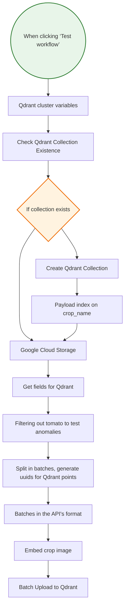

```mermaid
graph TD
    classDef trigger fill:#e8f5e9,stroke:#2e7d32,stroke-width:2px;
    classDef ai fill:#e3f2fd,stroke:#1565c0,stroke-width:2px;
    classDef logic fill:#fff3e0,stroke:#ef6c00,stroke-width:2px;

    When_clicking__Test_workflow_(("When clicking ‘Test workflow’")):::trigger
    Google_Cloud_Storage["Google Cloud Storage"]
    Get_fields_for_Qdrant["Get fields for Qdrant"]
    Qdrant_cluster_variables["Qdrant cluster variables"]
    Embed_crop_image["Embed crop image"]
    Create_Qdrant_Collection["Create Qdrant Collection"]
    Check_Qdrant_Collection_Existence["Check Qdrant Collection Existence"]
    Batches_in_the_API_s_format["Batches in the API's format"]
    Batch_Upload_to_Qdrant["Batch Upload to Qdrant"]
    Split_in_batches__generate_uuids_for_Qdrant_points["Split in batches, generate uuids for Qdrant points"]
    If_collection_exists{"If collection exists"}:::logic
    Payload_index_on_crop_name["Payload index on crop_name"]
    Filtering_out_tomato_to_test_anomalies["Filtering out tomato to test anomalies"]

    Embed_crop_image --> Batch_Upload_to_Qdrant
    Google_Cloud_Storage --> Get_fields_for_Qdrant
    If_collection_exists --> Google_Cloud_Storage
    If_collection_exists --> Create_Qdrant_Collection
    Get_fields_for_Qdrant --> Filtering_out_tomato_to_test_anomalies
    Create_Qdrant_Collection --> Payload_index_on_crop_name
    Qdrant_cluster_variables --> Check_Qdrant_Collection_Existence
    Payload_index_on_crop_name --> Google_Cloud_Storage
    Batches_in_the_API_s_format --> Embed_crop_image
    Check_Qdrant_Collection_Existence --> If_collection_exists
    When_clicking__Test_workflow_ --> Qdrant_cluster_variables
    Filtering_out_tomato_to_test_anomalies --> Split_in_batches__generate_uuids_for_Qdrant_points
    Split_in_batches__generate_uuids_for_Qdrant_points --> Batches_in_the_API_s_format
```
