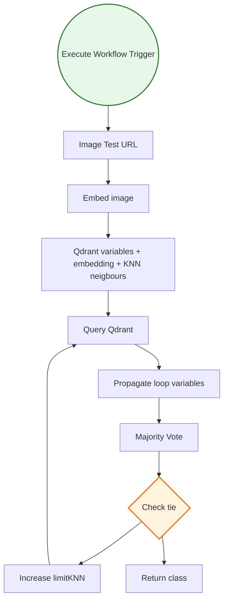

```mermaid
graph TD
    classDef trigger fill:#e8f5e9,stroke:#2e7d32,stroke-width:2px;
    classDef ai fill:#e3f2fd,stroke:#1565c0,stroke-width:2px;
    classDef logic fill:#fff3e0,stroke:#ef6c00,stroke-width:2px;

    Embed_image["Embed image"]
    Query_Qdrant["Query Qdrant"]
    Majority_Vote["Majority Vote"]
    Increase_limitKNN["Increase limitKNN"]
    Propagate_loop_variables["Propagate loop variables"]
    Image_Test_URL["Image Test URL"]
    Return_class["Return class"]
    Check_tie{"Check tie"}:::logic
    Qdrant_variables___embedding___KNN_neigbours["Qdrant variables + embedding + KNN neigbours"]
    Execute_Workflow_Trigger(("Execute Workflow Trigger")):::trigger

    Check_tie --> Increase_limitKNN
    Check_tie --> Return_class
    Embed_image --> Qdrant_variables___embedding___KNN_neigbours
    Query_Qdrant --> Propagate_loop_variables
    Majority_Vote --> Check_tie
    Image_Test_URL --> Embed_image
    Increase_limitKNN --> Query_Qdrant
    Execute_Workflow_Trigger --> Image_Test_URL
    Propagate_loop_variables --> Majority_Vote
    Qdrant_variables___embedding___KNN_neigbours --> Query_Qdrant
```
