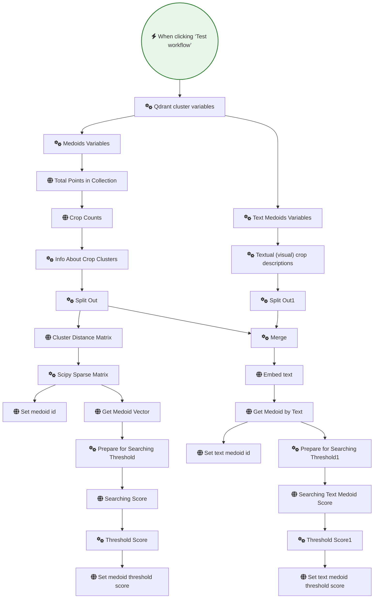

```mermaid
graph TD
    classDef trigger fill:#e8f5e9,stroke:#2e7d32,stroke-width:2px;
    classDef ai fill:#e3f2fd,stroke:#1565c0,stroke-width:2px;
    classDef logic fill:#fff3e0,stroke:#ef6c00,stroke-width:2px;

    When_clicking__Test_workflow_(("fas:fa-bolt When clicking ‘Test workflow’")):::trigger
    Total_Points_in_Collection["fas:fa-globe Total Points in Collection"]
    Cluster_Distance_Matrix["fas:fa-globe Cluster Distance Matrix"]
    Scipy_Sparse_Matrix["fas:fa-cogs Scipy Sparse Matrix"]
    Set_medoid_id["fas:fa-globe Set medoid id"]
    Get_Medoid_Vector["fas:fa-globe Get Medoid Vector"]
    Prepare_for_Searching_Threshold["fas:fa-cogs Prepare for Searching Threshold"]
    Searching_Score["fas:fa-globe Searching Score"]
    Threshold_Score["fas:fa-cogs Threshold Score"]
    Set_medoid_threshold_score["fas:fa-globe Set medoid threshold score"]
    Split_Out1["fas:fa-cogs Split Out1"]
    Merge["fas:fa-cogs Merge"]
    Textual__visual__crop_descriptions["fas:fa-cogs Textual (visual) crop descriptions"]
    Embed_text["fas:fa-globe Embed text"]
    Get_Medoid_by_Text["fas:fa-globe Get Medoid by Text"]
    Set_text_medoid_id["fas:fa-globe Set text medoid id"]
    Prepare_for_Searching_Threshold1["fas:fa-cogs Prepare for Searching Threshold1"]
    Threshold_Score1["fas:fa-cogs Threshold Score1"]
    Searching_Text_Medoid_Score["fas:fa-globe Searching Text Medoid Score"]
    Medoids_Variables["fas:fa-cogs Medoids Variables"]
    Text_Medoids_Variables["fas:fa-cogs Text Medoids Variables"]
    Qdrant_cluster_variables["fas:fa-cogs Qdrant cluster variables"]
    Info_About_Crop_Clusters["fas:fa-cogs Info About Crop Clusters"]
    Crop_Counts["fas:fa-globe Crop Counts"]
    Split_Out["fas:fa-cogs Split Out"]
    Set_text_medoid_threshold_score["fas:fa-globe Set text medoid threshold score"]

    Merge --> Embed_text
    Split_Out --> Cluster_Distance_Matrix
    Split_Out --> Merge
    Embed_text --> Get_Medoid_by_Text
    Split_Out1 --> Merge
    Crop_Counts --> Info_About_Crop_Clusters
    Searching_Score --> Threshold_Score
    Threshold_Score --> Set_medoid_threshold_score
    Threshold_Score1 --> Set_text_medoid_threshold_score
    Get_Medoid_Vector --> Prepare_for_Searching_Threshold
    Medoids_Variables --> Total_Points_in_Collection
    Get_Medoid_by_Text --> Set_text_medoid_id
    Get_Medoid_by_Text --> Prepare_for_Searching_Threshold1
    Scipy_Sparse_Matrix --> Set_medoid_id
    Scipy_Sparse_Matrix --> Get_Medoid_Vector
    Text_Medoids_Variables --> Textual__visual__crop_descriptions
    Cluster_Distance_Matrix --> Scipy_Sparse_Matrix
    Info_About_Crop_Clusters --> Split_Out
    Qdrant_cluster_variables --> Medoids_Variables
    Qdrant_cluster_variables --> Text_Medoids_Variables
    Total_Points_in_Collection --> Crop_Counts
    Searching_Text_Medoid_Score --> Threshold_Score1
    Prepare_for_Searching_Threshold --> Searching_Score
    Prepare_for_Searching_Threshold1 --> Searching_Text_Medoid_Score
    When_clicking__Test_workflow_ --> Qdrant_cluster_variables
    Textual__visual__crop_descriptions --> Split_Out1
```
