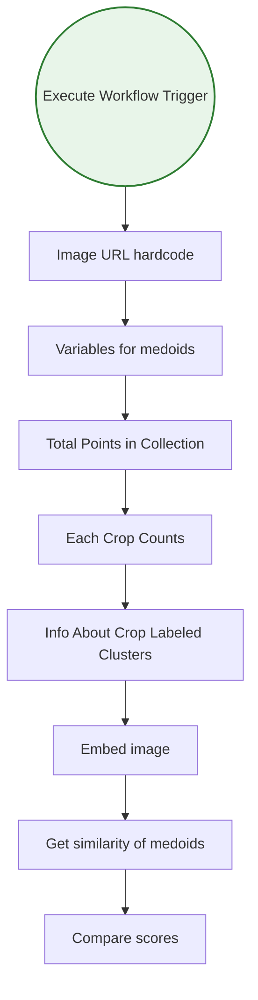

```mermaid
graph TD
    classDef trigger fill:#e8f5e9,stroke:#2e7d32,stroke-width:2px;
    classDef ai fill:#e3f2fd,stroke:#1565c0,stroke-width:2px;
    classDef logic fill:#fff3e0,stroke:#ef6c00,stroke-width:2px;

    Embed_image["Embed image"]
    Get_similarity_of_medoids["Get similarity of medoids"]
    Compare_scores["Compare scores"]
    Variables_for_medoids["Variables for medoids"]
    Info_About_Crop_Labeled_Clusters["Info About Crop Labeled Clusters"]
    Total_Points_in_Collection["Total Points in Collection"]
    Each_Crop_Counts["Each Crop Counts"]
    Image_URL_hardcode["Image URL hardcode"]
    Execute_Workflow_Trigger(("Execute Workflow Trigger")):::trigger

    Embed_image --> Get_similarity_of_medoids
    Each_Crop_Counts --> Info_About_Crop_Labeled_Clusters
    Image_URL_hardcode --> Variables_for_medoids
    Variables_for_medoids --> Total_Points_in_Collection
    Execute_Workflow_Trigger --> Image_URL_hardcode
    Get_similarity_of_medoids --> Compare_scores
    Total_Points_in_Collection --> Each_Crop_Counts
    Info_About_Crop_Labeled_Clusters --> Embed_image
```
