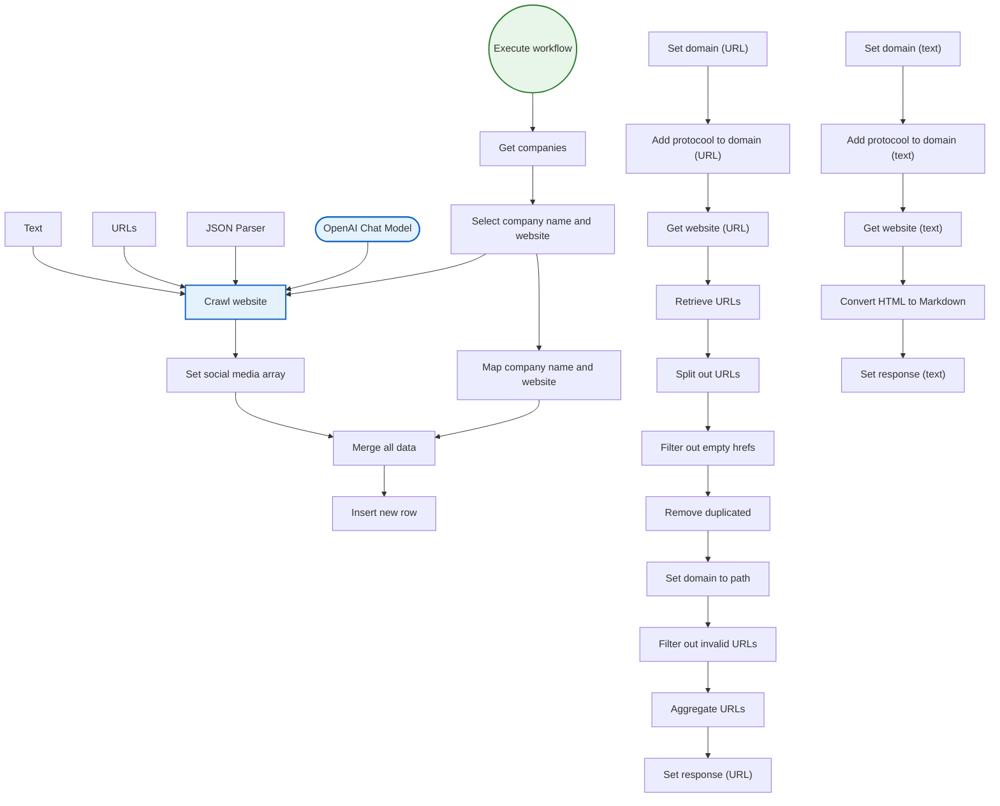

```mermaid
graph TD
    classDef trigger fill:#e8f5e9,stroke:#2e7d32,stroke-width:2px;
    classDef ai fill:#e3f2fd,stroke:#1565c0,stroke-width:2px;
    classDef logic fill:#fff3e0,stroke:#ef6c00,stroke-width:2px;

    Text["Text"]
    URLs["URLs"]
    OpenAI_Chat_Model(["OpenAI Chat Model"]):::ai
    JSON_Parser["JSON Parser"]
    Map_company_name_and_website["Map company name and website"]
    Execute_workflow(("Execute workflow")):::trigger
    Get_companies["Get companies"]
    Select_company_name_and_website["Select company name and website"]
    Set_social_media_array["Set social media array"]
    Merge_all_data["Merge all data"]
    Insert_new_row["Insert new row"]
    Convert_HTML_to_Markdown["Convert HTML to Markdown"]
    Retrieve_URLs["Retrieve URLs"]
    Split_out_URLs["Split out URLs"]
    Remove_duplicated["Remove duplicated"]
    Set_domain_to_path["Set domain to path"]
    Filter_out_invalid_URLs["Filter out invalid URLs"]
    Aggregate_URLs["Aggregate URLs"]
    Filter_out_empty_hrefs["Filter out empty hrefs"]
    Set_domain__text_["Set domain (text)"]
    Add_protocool_to_domain__text_["Add protocool to domain (text)"]
    Get_website__text_["Get website (text)"]
    Set_response__text_["Set response (text)"]
    Set_domain__URL_["Set domain (URL)"]
    Get_website__URL_["Get website (URL)"]
    Set_response__URL_["Set response (URL)"]
    Add_protocool_to_domain__URL_["Add protocool to domain (URL)"]
    Crawl_website["Crawl website"]:::ai

    Text --> Crawl_website
    URLs --> Crawl_website
    JSON_Parser --> Crawl_website
    Crawl_website --> Set_social_media_array
    Get_companies --> Select_company_name_and_website
    Retrieve_URLs --> Split_out_URLs
    Aggregate_URLs --> Set_response__URL_
    Merge_all_data --> Insert_new_row
    Split_out_URLs --> Filter_out_empty_hrefs
    Execute_workflow --> Get_companies
    Set_domain__URL_ --> Add_protocool_to_domain__URL_
    Get_website__URL_ --> Retrieve_URLs
    OpenAI_Chat_Model --> Crawl_website
    Remove_duplicated --> Set_domain_to_path
    Set_domain__text_ --> Add_protocool_to_domain__text_
    Get_website__text_ --> Convert_HTML_to_Markdown
    Set_domain_to_path --> Filter_out_invalid_URLs
    Filter_out_empty_hrefs --> Remove_duplicated
    Set_social_media_array --> Merge_all_data
    Filter_out_invalid_URLs --> Aggregate_URLs
    Convert_HTML_to_Markdown --> Set_response__text_
    Map_company_name_and_website --> Merge_all_data
    Add_protocool_to_domain__URL_ --> Get_website__URL_
    Add_protocool_to_domain__text_ --> Get_website__text_
    Select_company_name_and_website --> Crawl_website
    Select_company_name_and_website --> Map_company_name_and_website
```
