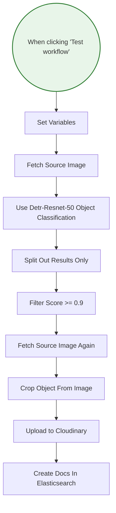

```mermaid
graph TD
    classDef trigger fill:#e8f5e9,stroke:#2e7d32,stroke-width:2px;
    classDef ai fill:#e3f2fd,stroke:#1565c0,stroke-width:2px;
    classDef logic fill:#fff3e0,stroke:#ef6c00,stroke-width:2px;

    When_clicking__Test_workflow_(("When clicking 'Test workflow'")):::trigger
    Fetch_Source_Image["Fetch Source Image"]
    Split_Out_Results_Only["Split Out Results Only"]
    Filter_Score____0_9["Filter Score >= 0.9"]
    Crop_Object_From_Image["Crop Object From Image"]
    Set_Variables["Set Variables"]
    Use_Detr_Resnet_50_Object_Classification["Use Detr-Resnet-50 Object Classification"]
    Upload_to_Cloudinary["Upload to Cloudinary"]
    Create_Docs_In_Elasticsearch["Create Docs In Elasticsearch"]
    Fetch_Source_Image_Again["Fetch Source Image Again"]

    Set_Variables --> Fetch_Source_Image
    Fetch_Source_Image --> Use_Detr_Resnet_50_Object_Classification
    Filter_Score____0_9 --> Fetch_Source_Image_Again
    Upload_to_Cloudinary --> Create_Docs_In_Elasticsearch
    Crop_Object_From_Image --> Upload_to_Cloudinary
    Split_Out_Results_Only --> Filter_Score____0_9
    Fetch_Source_Image_Again --> Crop_Object_From_Image
    When_clicking__Test_workflow_ --> Set_Variables
    Use_Detr_Resnet_50_Object_Classification --> Split_Out_Results_Only
```
