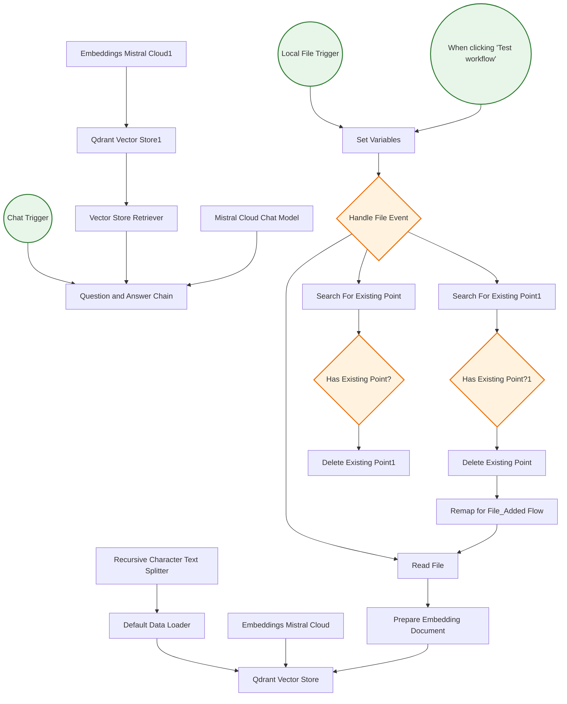

```mermaid
graph TD
    classDef trigger fill:#e8f5e9,stroke:#2e7d32,stroke-width:2px;
    classDef ai fill:#e3f2fd,stroke:#1565c0,stroke-width:2px;
    classDef logic fill:#fff3e0,stroke:#ef6c00,stroke-width:2px;

    Local_File_Trigger(("Local File Trigger")):::trigger
    When_clicking__Test_workflow_(("When clicking 'Test workflow'")):::trigger
    Set_Variables["Set Variables"]
    Read_File["Read File"]
    Embeddings_Mistral_Cloud["Embeddings Mistral Cloud"]
    Default_Data_Loader["Default Data Loader"]
    Recursive_Character_Text_Splitter["Recursive Character Text Splitter"]
    Prepare_Embedding_Document["Prepare Embedding Document"]
    Chat_Trigger(("Chat Trigger")):::trigger
    Question_and_Answer_Chain["Question and Answer Chain"]
    Mistral_Cloud_Chat_Model["Mistral Cloud Chat Model"]
    Vector_Store_Retriever["Vector Store Retriever"]
    Embeddings_Mistral_Cloud1["Embeddings Mistral Cloud1"]
    Remap_for_File_Added_Flow["Remap for File_Added Flow"]
    Search_For_Existing_Point["Search For Existing Point"]
    Has_Existing_Point_{"Has Existing Point?"}:::logic
    Delete_Existing_Point["Delete Existing Point"]
    Search_For_Existing_Point1["Search For Existing Point1"]
    Has_Existing_Point_1{"Has Existing Point?1"}:::logic
    Delete_Existing_Point1["Delete Existing Point1"]
    Handle_File_Event{"Handle File Event"}:::logic
    Qdrant_Vector_Store["Qdrant Vector Store"]
    Qdrant_Vector_Store1["Qdrant Vector Store1"]

    Read_File --> Prepare_Embedding_Document
    Chat_Trigger --> Question_and_Answer_Chain
    Set_Variables --> Handle_File_Event
    Handle_File_Event --> Search_For_Existing_Point
    Handle_File_Event --> Search_For_Existing_Point1
    Handle_File_Event --> Read_File
    Local_File_Trigger --> Set_Variables
    Default_Data_Loader --> Qdrant_Vector_Store
    Has_Existing_Point_ --> Delete_Existing_Point1
    Has_Existing_Point_1 --> Delete_Existing_Point
    Qdrant_Vector_Store1 --> Vector_Store_Retriever
    Delete_Existing_Point --> Remap_for_File_Added_Flow
    Vector_Store_Retriever --> Question_and_Answer_Chain
    Embeddings_Mistral_Cloud --> Qdrant_Vector_Store
    Mistral_Cloud_Chat_Model --> Question_and_Answer_Chain
    Embeddings_Mistral_Cloud1 --> Qdrant_Vector_Store1
    Remap_for_File_Added_Flow --> Read_File
    Search_For_Existing_Point --> Has_Existing_Point_
    Prepare_Embedding_Document --> Qdrant_Vector_Store
    Search_For_Existing_Point1 --> Has_Existing_Point_1
    When_clicking__Test_workflow_ --> Set_Variables
    Recursive_Character_Text_Splitter --> Default_Data_Loader
```
