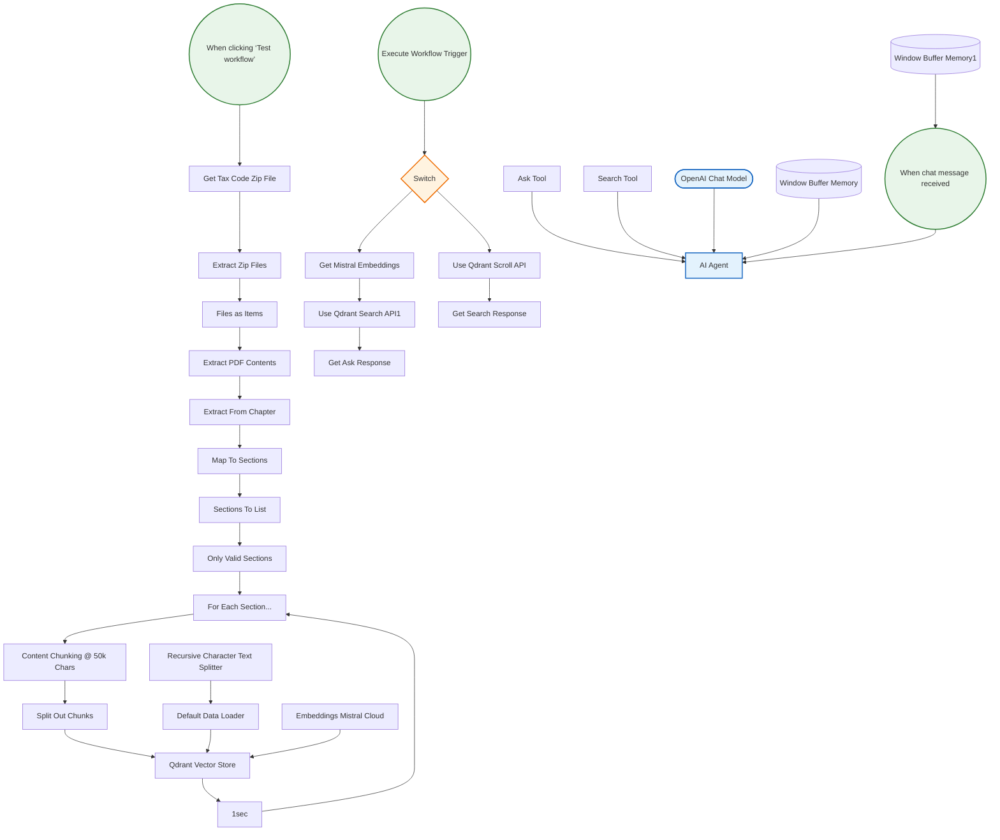

```mermaid
graph TD
    classDef trigger fill:#e8f5e9,stroke:#2e7d32,stroke-width:2px;
    classDef ai fill:#e3f2fd,stroke:#1565c0,stroke-width:2px;
    classDef logic fill:#fff3e0,stroke:#ef6c00,stroke-width:2px;

    When_clicking__Test_workflow_(("When clicking ‘Test workflow’")):::trigger
    Embeddings_Mistral_Cloud["Embeddings Mistral Cloud"]
    Default_Data_Loader["Default Data Loader"]
    Recursive_Character_Text_Splitter["Recursive Character Text Splitter"]
    Get_Tax_Code_Zip_File["Get Tax Code Zip File"]
    Extract_Zip_Files["Extract Zip Files"]
    Files_as_Items["Files as Items"]
    Extract_PDF_Contents["Extract PDF Contents"]
    Extract_From_Chapter["Extract From Chapter"]
    Map_To_Sections["Map To Sections"]
    Execute_Workflow_Trigger(("Execute Workflow Trigger")):::trigger
    Get_Mistral_Embeddings["Get Mistral Embeddings"]
    Content_Chunking___50k_Chars["Content Chunking @ 50k Chars"]
    Split_Out_Chunks["Split Out Chunks"]
    For_Each_Section___["For Each Section..."]
    Sections_To_List["Sections To List"]
    Only_Valid_Sections["Only Valid Sections"]
    Use_Qdrant_Search_API1["Use Qdrant Search API1"]
    Use_Qdrant_Scroll_API["Use Qdrant Scroll API"]
    Get_Search_Response["Get Search Response"]
    Qdrant_Vector_Store["Qdrant Vector Store"]
    AI_Agent["AI Agent"]:::ai
    Window_Buffer_Memory[("Window Buffer Memory")]
    When_chat_message_received(("When chat message received")):::trigger
    Window_Buffer_Memory1[("Window Buffer Memory1")]
    OpenAI_Chat_Model(["OpenAI Chat Model"]):::ai
    n_1sec["1sec"]
    Ask_Tool["Ask Tool"]
    Search_Tool["Search Tool"]
    Switch{"Switch"}:::logic
    Get_Ask_Response["Get Ask Response"]

    n_1sec --> For_Each_Section___
    Switch --> Get_Mistral_Embeddings
    Switch --> Use_Qdrant_Scroll_API
    Ask_Tool --> AI_Agent
    Search_Tool --> AI_Agent
    Files_as_Items --> Extract_PDF_Contents
    Map_To_Sections --> Sections_To_List
    Sections_To_List --> Only_Valid_Sections
    Split_Out_Chunks --> Qdrant_Vector_Store
    Extract_Zip_Files --> Files_as_Items
    OpenAI_Chat_Model --> AI_Agent
    Default_Data_Loader --> Qdrant_Vector_Store
    For_Each_Section___ --> Content_Chunking___50k_Chars
    Only_Valid_Sections --> For_Each_Section___
    Qdrant_Vector_Store --> n_1sec
    Extract_From_Chapter --> Map_To_Sections
    Extract_PDF_Contents --> Extract_From_Chapter
    Window_Buffer_Memory --> AI_Agent
    Get_Tax_Code_Zip_File --> Extract_Zip_Files
    Use_Qdrant_Scroll_API --> Get_Search_Response
    Window_Buffer_Memory1 --> When_chat_message_received
    Get_Mistral_Embeddings --> Use_Qdrant_Search_API1
    Use_Qdrant_Search_API1 --> Get_Ask_Response
    Embeddings_Mistral_Cloud --> Qdrant_Vector_Store
    Execute_Workflow_Trigger --> Switch
    When_chat_message_received --> AI_Agent
    Content_Chunking___50k_Chars --> Split_Out_Chunks
    Recursive_Character_Text_Splitter --> Default_Data_Loader
    When_clicking__Test_workflow_ --> Get_Tax_Code_Zip_File
```
