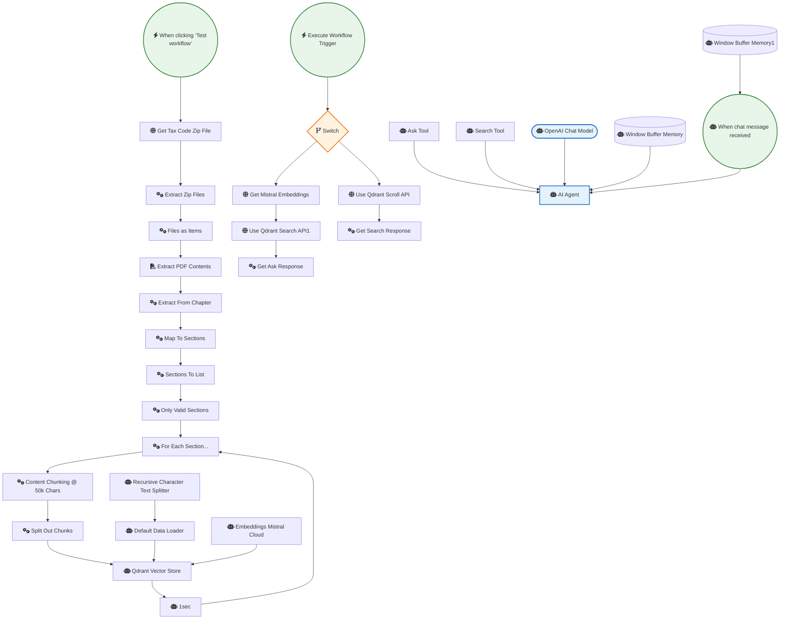

```mermaid
graph TD
    classDef trigger fill:#e8f5e9,stroke:#2e7d32,stroke-width:2px;
    classDef ai fill:#e3f2fd,stroke:#1565c0,stroke-width:2px;
    classDef logic fill:#fff3e0,stroke:#ef6c00,stroke-width:2px;

    When_clicking__Test_workflow_(("fas:fa-bolt When clicking ‘Test workflow’")):::trigger
    Embeddings_Mistral_Cloud["fas:fa-robot Embeddings Mistral Cloud"]
    Default_Data_Loader["fas:fa-robot Default Data Loader"]
    Recursive_Character_Text_Splitter["fas:fa-robot Recursive Character Text Splitter"]
    Get_Tax_Code_Zip_File["fas:fa-globe Get Tax Code Zip File"]
    Extract_Zip_Files["fas:fa-cogs Extract Zip Files"]
    Files_as_Items["fas:fa-cogs Files as Items"]
    Extract_PDF_Contents["fas:fa-file-pdf Extract PDF Contents"]
    Extract_From_Chapter["fas:fa-cogs Extract From Chapter"]
    Map_To_Sections["fas:fa-cogs Map To Sections"]
    Execute_Workflow_Trigger(("fas:fa-bolt Execute Workflow Trigger")):::trigger
    Get_Mistral_Embeddings["fas:fa-globe Get Mistral Embeddings"]
    Content_Chunking___50k_Chars["fas:fa-cogs Content Chunking @ 50k Chars"]
    Split_Out_Chunks["fas:fa-cogs Split Out Chunks"]
    For_Each_Section___["fas:fa-cogs For Each Section..."]
    Sections_To_List["fas:fa-cogs Sections To List"]
    Only_Valid_Sections["fas:fa-cogs Only Valid Sections"]
    Use_Qdrant_Search_API1["fas:fa-globe Use Qdrant Search API1"]
    Use_Qdrant_Scroll_API["fas:fa-globe Use Qdrant Scroll API"]
    Get_Search_Response["fas:fa-cogs Get Search Response"]
    Qdrant_Vector_Store["fas:fa-robot Qdrant Vector Store"]
    AI_Agent["fas:fa-robot AI Agent"]:::ai
    Window_Buffer_Memory[("fas:fa-robot Window Buffer Memory")]
    When_chat_message_received(("fas:fa-robot When chat message received")):::trigger
    Window_Buffer_Memory1[("fas:fa-robot Window Buffer Memory1")]
    OpenAI_Chat_Model(["fas:fa-robot OpenAI Chat Model"]):::ai
    n_1sec["fas:fa-robot 1sec"]
    Ask_Tool["fas:fa-robot Ask Tool"]
    Search_Tool["fas:fa-robot Search Tool"]
    Switch{"fas:fa-code-branch Switch"}:::logic
    Get_Ask_Response["fas:fa-cogs Get Ask Response"]

    n_1sec --> For_Each_Section___
    Switch --> Get_Mistral_Embeddings
    Switch --> Use_Qdrant_Scroll_API
    Ask_Tool --> AI_Agent
    Search_Tool --> AI_Agent
    Files_as_Items --> Extract_PDF_Contents
    Map_To_Sections --> Sections_To_List
    Sections_To_List --> Only_Valid_Sections
    Split_Out_Chunks --> Qdrant_Vector_Store
    Extract_Zip_Files --> Files_as_Items
    OpenAI_Chat_Model --> AI_Agent
    Default_Data_Loader --> Qdrant_Vector_Store
    For_Each_Section___ --> Content_Chunking___50k_Chars
    Only_Valid_Sections --> For_Each_Section___
    Qdrant_Vector_Store --> n_1sec
    Extract_From_Chapter --> Map_To_Sections
    Extract_PDF_Contents --> Extract_From_Chapter
    Window_Buffer_Memory --> AI_Agent
    Get_Tax_Code_Zip_File --> Extract_Zip_Files
    Use_Qdrant_Scroll_API --> Get_Search_Response
    Window_Buffer_Memory1 --> When_chat_message_received
    Get_Mistral_Embeddings --> Use_Qdrant_Search_API1
    Use_Qdrant_Search_API1 --> Get_Ask_Response
    Embeddings_Mistral_Cloud --> Qdrant_Vector_Store
    Execute_Workflow_Trigger --> Switch
    When_chat_message_received --> AI_Agent
    Content_Chunking___50k_Chars --> Split_Out_Chunks
    Recursive_Character_Text_Splitter --> Default_Data_Loader
    When_clicking__Test_workflow_ --> Get_Tax_Code_Zip_File
```
