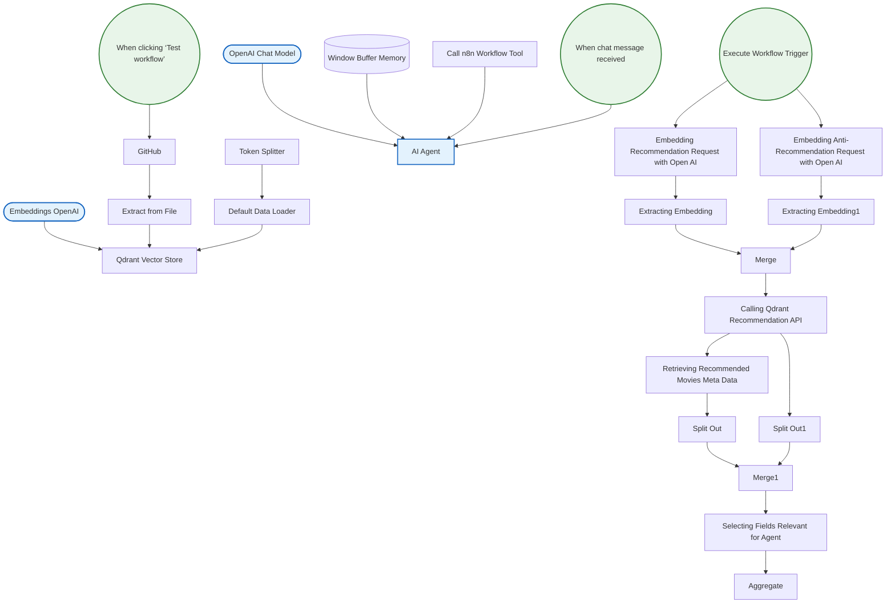

```mermaid
graph TD
    classDef trigger fill:#e8f5e9,stroke:#2e7d32,stroke-width:2px;
    classDef ai fill:#e3f2fd,stroke:#1565c0,stroke-width:2px;
    classDef logic fill:#fff3e0,stroke:#ef6c00,stroke-width:2px;

    When_clicking__Test_workflow_(("When clicking ‘Test workflow’")):::trigger
    GitHub["GitHub"]
    Extract_from_File["Extract from File"]
    Embeddings_OpenAI(["Embeddings OpenAI"]):::ai
    Default_Data_Loader["Default Data Loader"]
    Token_Splitter["Token Splitter"]
    Qdrant_Vector_Store["Qdrant Vector Store"]
    When_chat_message_received(("When chat message received")):::trigger
    OpenAI_Chat_Model(["OpenAI Chat Model"]):::ai
    Call_n8n_Workflow_Tool["Call n8n Workflow Tool"]
    Window_Buffer_Memory[("Window Buffer Memory")]
    Execute_Workflow_Trigger(("Execute Workflow Trigger")):::trigger
    Merge["Merge"]
    Split_Out["Split Out"]
    Split_Out1["Split Out1"]
    Merge1["Merge1"]
    Aggregate["Aggregate"]
    AI_Agent["AI Agent"]:::ai
    Embedding_Recommendation_Request_with_Open_AI["Embedding Recommendation Request with Open AI"]
    Embedding_Anti_Recommendation_Request_with_Open_AI["Embedding Anti-Recommendation Request with Open AI"]
    Extracting_Embedding["Extracting Embedding"]
    Extracting_Embedding1["Extracting Embedding1"]
    Calling_Qdrant_Recommendation_API["Calling Qdrant Recommendation API"]
    Retrieving_Recommended_Movies_Meta_Data["Retrieving Recommended Movies Meta Data"]
    Selecting_Fields_Relevant_for_Agent["Selecting Fields Relevant for Agent"]

    Merge --> Calling_Qdrant_Recommendation_API
    GitHub --> Extract_from_File
    Merge1 --> Selecting_Fields_Relevant_for_Agent
    Split_Out --> Merge1
    Split_Out1 --> Merge1
    Token_Splitter --> Default_Data_Loader
    Embeddings_OpenAI --> Qdrant_Vector_Store
    Extract_from_File --> Qdrant_Vector_Store
    OpenAI_Chat_Model --> AI_Agent
    Default_Data_Loader --> Qdrant_Vector_Store
    Extracting_Embedding --> Merge
    Window_Buffer_Memory --> AI_Agent
    Extracting_Embedding1 --> Merge
    Call_n8n_Workflow_Tool --> AI_Agent
    Execute_Workflow_Trigger --> Embedding_Recommendation_Request_with_Open_AI
    Execute_Workflow_Trigger --> Embedding_Anti_Recommendation_Request_with_Open_AI
    When_chat_message_received --> AI_Agent
    Calling_Qdrant_Recommendation_API --> Retrieving_Recommended_Movies_Meta_Data
    Calling_Qdrant_Recommendation_API --> Split_Out1
    When_clicking__Test_workflow_ --> GitHub
    Selecting_Fields_Relevant_for_Agent --> Aggregate
    Retrieving_Recommended_Movies_Meta_Data --> Split_Out
    Embedding_Recommendation_Request_with_Open_AI --> Extracting_Embedding
    Embedding_Anti_Recommendation_Request_with_Open_AI --> Extracting_Embedding1
```
