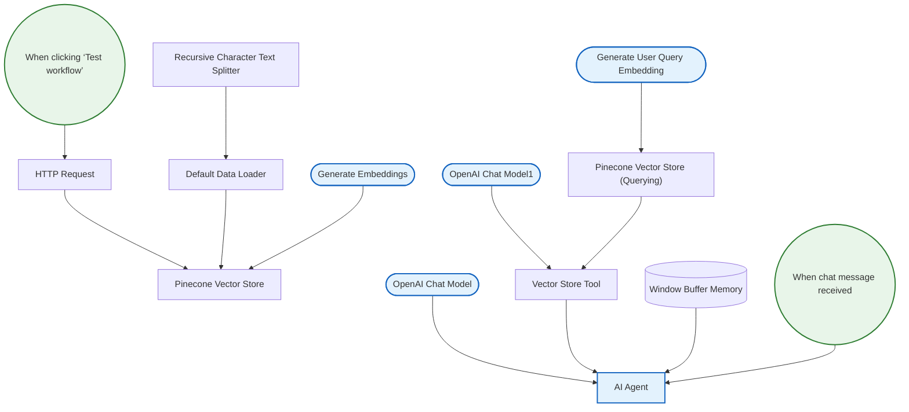

```mermaid
graph TD
    classDef trigger fill:#e8f5e9,stroke:#2e7d32,stroke-width:2px;
    classDef ai fill:#e3f2fd,stroke:#1565c0,stroke-width:2px;
    classDef logic fill:#fff3e0,stroke:#ef6c00,stroke-width:2px;

    When_clicking__Test_workflow_(("When clicking ‘Test workflow’")):::trigger
    HTTP_Request["HTTP Request"]
    Pinecone_Vector_Store["Pinecone Vector Store"]
    Default_Data_Loader["Default Data Loader"]
    Recursive_Character_Text_Splitter["Recursive Character Text Splitter"]
    When_chat_message_received(("When chat message received")):::trigger
    AI_Agent["AI Agent"]:::ai
    OpenAI_Chat_Model(["OpenAI Chat Model"]):::ai
    Window_Buffer_Memory[("Window Buffer Memory")]
    Vector_Store_Tool["Vector Store Tool"]
    OpenAI_Chat_Model1(["OpenAI Chat Model1"]):::ai
    Generate_User_Query_Embedding(["Generate User Query Embedding"]):::ai
    Pinecone_Vector_Store__Querying_["Pinecone Vector Store (Querying)"]
    Generate_Embeddings(["Generate Embeddings"]):::ai

    HTTP_Request --> Pinecone_Vector_Store
    OpenAI_Chat_Model --> AI_Agent
    Vector_Store_Tool --> AI_Agent
    OpenAI_Chat_Model1 --> Vector_Store_Tool
    Default_Data_Loader --> Pinecone_Vector_Store
    Generate_Embeddings --> Pinecone_Vector_Store
    Window_Buffer_Memory --> AI_Agent
    When_chat_message_received --> AI_Agent
    Generate_User_Query_Embedding --> Pinecone_Vector_Store__Querying_
    Pinecone_Vector_Store__Querying_ --> Vector_Store_Tool
    Recursive_Character_Text_Splitter --> Default_Data_Loader
    When_clicking__Test_workflow_ --> HTTP_Request
```
