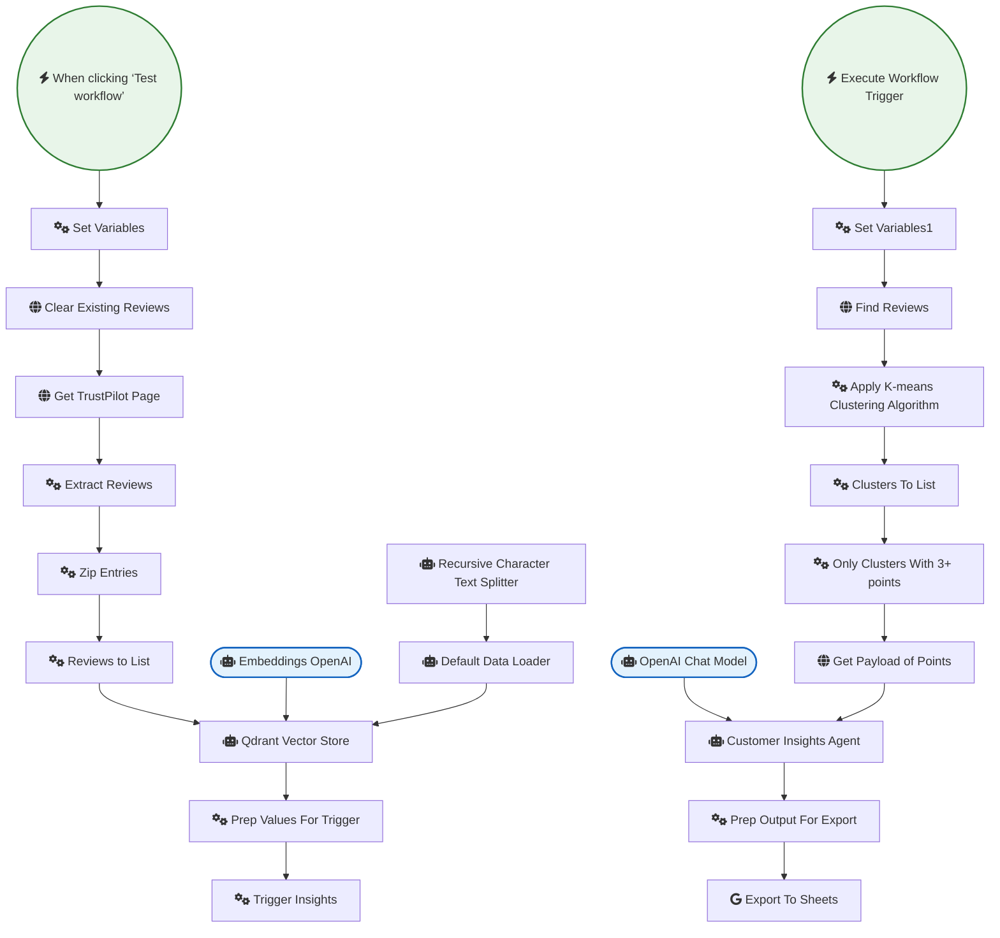

```mermaid
graph TD
    classDef trigger fill:#e8f5e9,stroke:#2e7d32,stroke-width:2px;
    classDef ai fill:#e3f2fd,stroke:#1565c0,stroke-width:2px;
    classDef logic fill:#fff3e0,stroke:#ef6c00,stroke-width:2px;

    When_clicking__Test_workflow_(("fas:fa-bolt When clicking ‘Test workflow’")):::trigger
    Zip_Entries["fas:fa-cogs Zip Entries"]
    Extract_Reviews["fas:fa-cogs Extract Reviews"]
    Reviews_to_List["fas:fa-cogs Reviews to List"]
    Default_Data_Loader["fas:fa-robot Default Data Loader"]
    Recursive_Character_Text_Splitter["fas:fa-robot Recursive Character Text Splitter"]
    Embeddings_OpenAI(["fas:fa-robot Embeddings OpenAI"]):::ai
    Set_Variables["fas:fa-cogs Set Variables"]
    Get_Payload_of_Points["fas:fa-globe Get Payload of Points"]
    Clusters_To_List["fas:fa-cogs Clusters To List"]
    OpenAI_Chat_Model(["fas:fa-robot OpenAI Chat Model"]):::ai
    Only_Clusters_With_3__points["fas:fa-cogs Only Clusters With 3+ points"]
    Set_Variables1["fas:fa-cogs Set Variables1"]
    Find_Reviews["fas:fa-globe Find Reviews"]
    Prep_Output_For_Export["fas:fa-cogs Prep Output For Export"]
    Export_To_Sheets["fab:fa-google Export To Sheets"]
    Clear_Existing_Reviews["fas:fa-globe Clear Existing Reviews"]
    Trigger_Insights["fas:fa-cogs Trigger Insights"]
    Prep_Values_For_Trigger["fas:fa-cogs Prep Values For Trigger"]
    Execute_Workflow_Trigger(("fas:fa-bolt Execute Workflow Trigger")):::trigger
    Get_TrustPilot_Page["fas:fa-globe Get TrustPilot Page"]
    Qdrant_Vector_Store["fas:fa-robot Qdrant Vector Store"]
    Apply_K_means_Clustering_Algorithm["fas:fa-cogs Apply K-means Clustering Algorithm"]
    Customer_Insights_Agent["fas:fa-robot Customer Insights Agent"]

    Zip_Entries --> Reviews_to_List
    Find_Reviews --> Apply_K_means_Clustering_Algorithm
    Set_Variables --> Clear_Existing_Reviews
    Set_Variables1 --> Find_Reviews
    Extract_Reviews --> Zip_Entries
    Reviews_to_List --> Qdrant_Vector_Store
    Clusters_To_List --> Only_Clusters_With_3__points
    Embeddings_OpenAI --> Qdrant_Vector_Store
    OpenAI_Chat_Model --> Customer_Insights_Agent
    Default_Data_Loader --> Qdrant_Vector_Store
    Get_TrustPilot_Page --> Extract_Reviews
    Qdrant_Vector_Store --> Prep_Values_For_Trigger
    Get_Payload_of_Points --> Customer_Insights_Agent
    Clear_Existing_Reviews --> Get_TrustPilot_Page
    Prep_Output_For_Export --> Export_To_Sheets
    Customer_Insights_Agent --> Prep_Output_For_Export
    Prep_Values_For_Trigger --> Trigger_Insights
    Execute_Workflow_Trigger --> Set_Variables1
    Only_Clusters_With_3__points --> Get_Payload_of_Points
    Recursive_Character_Text_Splitter --> Default_Data_Loader
    When_clicking__Test_workflow_ --> Set_Variables
    Apply_K_means_Clustering_Algorithm --> Clusters_To_List
```
