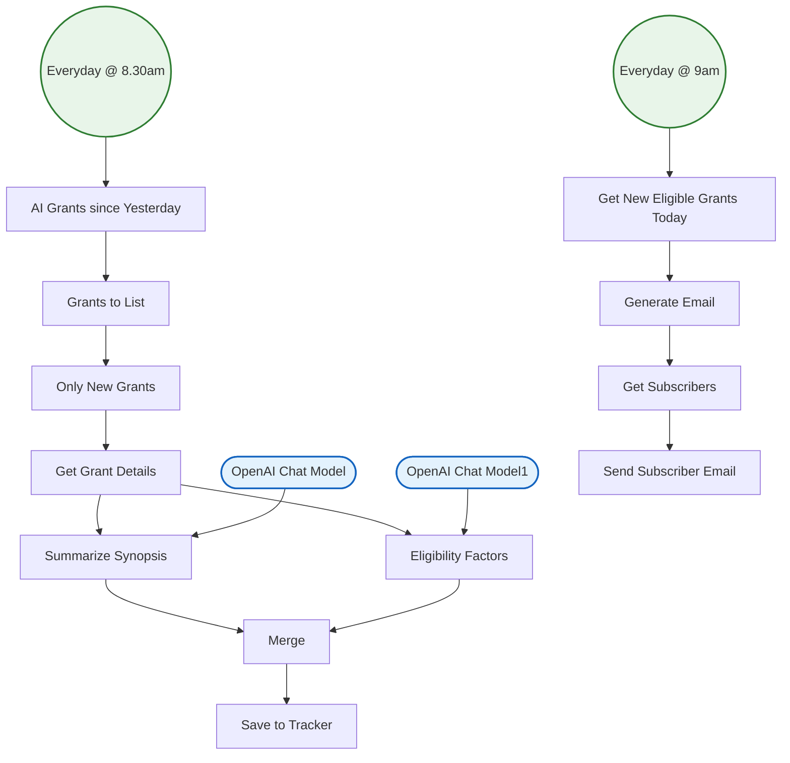

```mermaid
graph TD
    classDef trigger fill:#e8f5e9,stroke:#2e7d32,stroke-width:2px;
    classDef ai fill:#e3f2fd,stroke:#1565c0,stroke-width:2px;
    classDef logic fill:#fff3e0,stroke:#ef6c00,stroke-width:2px;

    Grants_to_List["Grants to List"]
    Get_Grant_Details["Get Grant Details"]
    OpenAI_Chat_Model(["OpenAI Chat Model"]):::ai
    Summarize_Synopsis["Summarize Synopsis"]
    Eligibility_Factors["Eligibility Factors"]
    OpenAI_Chat_Model1(["OpenAI Chat Model1"]):::ai
    Merge["Merge"]
    Save_to_Tracker["Save to Tracker"]
    Only_New_Grants["Only New Grants"]
    AI_Grants_since_Yesterday["AI Grants since Yesterday"]
    Get_New_Eligible_Grants_Today["Get New Eligible Grants Today"]
    Generate_Email["Generate Email"]
    Everyday___9am(("Everyday @ 9am")):::trigger
    Everyday___8_30am(("Everyday @ 8.30am")):::trigger
    Get_Subscribers["Get Subscribers"]
    Send_Subscriber_Email["Send Subscriber Email"]

    Merge --> Save_to_Tracker
    Everyday___9am --> Get_New_Eligible_Grants_Today
    Generate_Email --> Get_Subscribers
    Grants_to_List --> Only_New_Grants
    Get_Subscribers --> Send_Subscriber_Email
    Only_New_Grants --> Get_Grant_Details
    Everyday___8_30am --> AI_Grants_since_Yesterday
    Get_Grant_Details --> Summarize_Synopsis
    Get_Grant_Details --> Eligibility_Factors
    OpenAI_Chat_Model --> Summarize_Synopsis
    OpenAI_Chat_Model1 --> Eligibility_Factors
    Summarize_Synopsis --> Merge
    Eligibility_Factors --> Merge
    AI_Grants_since_Yesterday --> Grants_to_List
    Get_New_Eligible_Grants_Today --> Generate_Email
```
