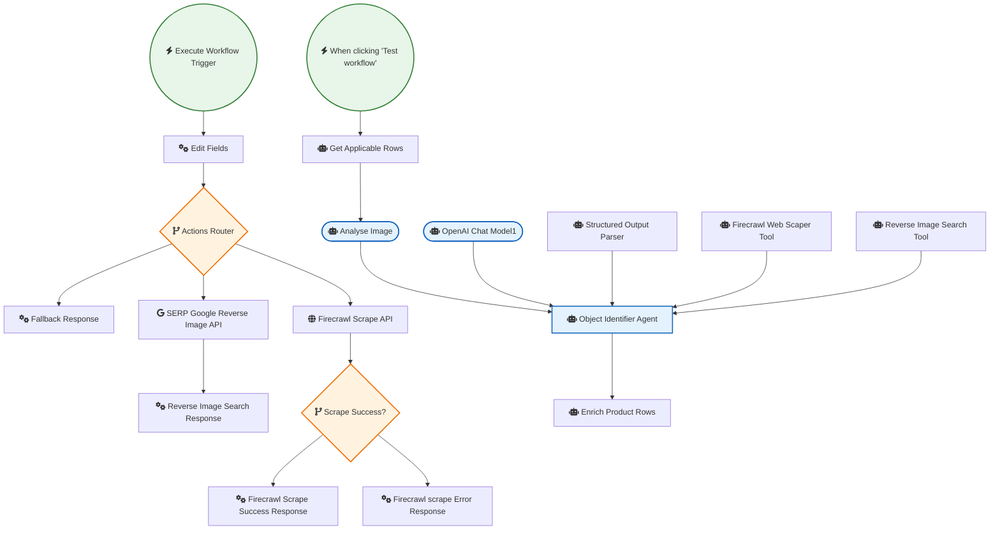

```mermaid
graph TD
    classDef trigger fill:#e8f5e9,stroke:#2e7d32,stroke-width:2px;
    classDef ai fill:#e3f2fd,stroke:#1565c0,stroke-width:2px;
    classDef logic fill:#fff3e0,stroke:#ef6c00,stroke-width:2px;

    When_clicking__Test_workflow_(("fas:fa-bolt When clicking 'Test workflow'")):::trigger
    OpenAI_Chat_Model1(["fas:fa-robot OpenAI Chat Model1"]):::ai
    Get_Applicable_Rows["fas:fa-robot Get Applicable Rows"]
    Execute_Workflow_Trigger(("fas:fa-bolt Execute Workflow Trigger")):::trigger
    Edit_Fields["fas:fa-cogs Edit Fields"]
    Fallback_Response["fas:fa-cogs Fallback Response"]
    SERP_Google_Reverse_Image_API["fab:fa-google SERP Google Reverse Image API"]
    Reverse_Image_Search_Response["fas:fa-cogs Reverse Image Search Response"]
    Reverse_Image_Search_Tool["fas:fa-robot Reverse Image Search Tool"]
    Firecrawl_Scrape_API["fas:fa-globe Firecrawl Scrape API"]
    Scrape_Success_{"fas:fa-code-branch Scrape Success?"}:::logic
    Firecrawl_Scrape_Success_Response["fas:fa-cogs Firecrawl Scrape Success Response"]
    Firecrawl_scrape_Error_Response["fas:fa-cogs Firecrawl scrape Error Response"]
    Firecrawl_Web_Scaper_Tool["fas:fa-robot Firecrawl Web Scaper Tool"]
    Structured_Output_Parser["fas:fa-robot Structured Output Parser"]
    Enrich_Product_Rows["fas:fa-robot Enrich Product Rows"]
    Analyse_Image(["fas:fa-robot Analyse Image"]):::ai
    Object_Identifier_Agent["fas:fa-robot Object Identifier Agent"]:::ai
    Actions_Router{"fas:fa-code-branch Actions Router"}:::logic

    Edit_Fields --> Actions_Router
    Analyse_Image --> Object_Identifier_Agent
    Actions_Router --> SERP_Google_Reverse_Image_API
    Actions_Router --> Firecrawl_Scrape_API
    Actions_Router --> Fallback_Response
    Scrape_Success_ --> Firecrawl_Scrape_Success_Response
    Scrape_Success_ --> Firecrawl_scrape_Error_Response
    OpenAI_Chat_Model1 --> Object_Identifier_Agent
    Get_Applicable_Rows --> Analyse_Image
    Firecrawl_Scrape_API --> Scrape_Success_
    Object_Identifier_Agent --> Enrich_Product_Rows
    Execute_Workflow_Trigger --> Edit_Fields
    Structured_Output_Parser --> Object_Identifier_Agent
    Firecrawl_Web_Scaper_Tool --> Object_Identifier_Agent
    Reverse_Image_Search_Tool --> Object_Identifier_Agent
    SERP_Google_Reverse_Image_API --> Reverse_Image_Search_Response
    When_clicking__Test_workflow_ --> Get_Applicable_Rows
```
