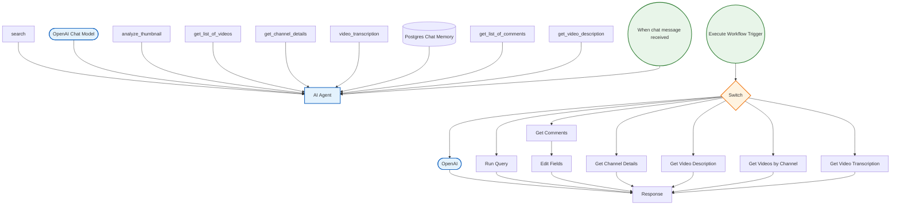

```mermaid
graph TD
    classDef trigger fill:#e8f5e9,stroke:#2e7d32,stroke-width:2px;
    classDef ai fill:#e3f2fd,stroke:#1565c0,stroke-width:2px;
    classDef logic fill:#fff3e0,stroke:#ef6c00,stroke-width:2px;

    OpenAI_Chat_Model(["OpenAI Chat Model"]):::ai
    get_channel_details["get_channel_details"]
    get_video_description["get_video_description"]
    get_list_of_videos["get_list_of_videos"]
    get_list_of_comments["get_list_of_comments"]
    search["search"]
    analyze_thumbnail["analyze_thumbnail"]
    video_transcription["video_transcription"]
    Postgres_Chat_Memory[("Postgres Chat Memory")]
    AI_Agent["AI Agent"]:::ai
    When_chat_message_received(("When chat message received")):::trigger
    Get_Comments["Get Comments"]
    Execute_Workflow_Trigger(("Execute Workflow Trigger")):::trigger
    Get_Channel_Details["Get Channel Details"]
    Get_Video_Description["Get Video Description"]
    Edit_Fields["Edit Fields"]
    Run_Query["Run Query"]
    Get_Videos_by_Channel["Get Videos by Channel"]
    Response["Response"]
    Switch{"Switch"}:::logic
    Get_Video_Transcription["Get Video Transcription"]
    OpenAI(["OpenAI"]):::ai

    OpenAI --> Response
    Switch --> Get_Channel_Details
    Switch --> Get_Video_Description
    Switch --> Get_Comments
    Switch --> Run_Query
    Switch --> Get_Videos_by_Channel
    Switch --> OpenAI
    Switch --> Get_Video_Transcription
    search --> AI_Agent
    Run_Query --> Response
    Edit_Fields --> Response
    Get_Comments --> Edit_Fields
    OpenAI_Chat_Model --> AI_Agent
    analyze_thumbnail --> AI_Agent
    get_list_of_videos --> AI_Agent
    Get_Channel_Details --> Response
    get_channel_details --> AI_Agent
    video_transcription --> AI_Agent
    Postgres_Chat_Memory --> AI_Agent
    get_list_of_comments --> AI_Agent
    Get_Video_Description --> Response
    Get_Videos_by_Channel --> Response
    get_video_description --> AI_Agent
    Get_Video_Transcription --> Response
    Execute_Workflow_Trigger --> Switch
    When_chat_message_received --> AI_Agent
```
