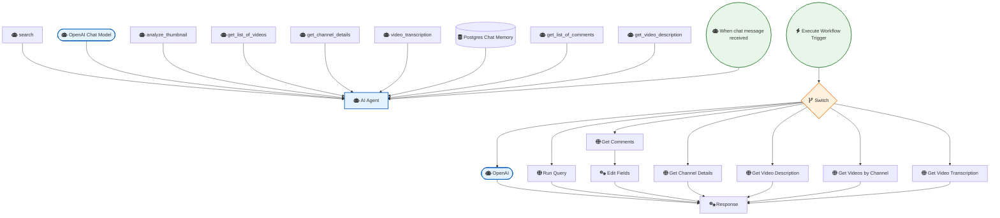

```mermaid
graph TD
    classDef trigger fill:#e8f5e9,stroke:#2e7d32,stroke-width:2px;
    classDef ai fill:#e3f2fd,stroke:#1565c0,stroke-width:2px;
    classDef logic fill:#fff3e0,stroke:#ef6c00,stroke-width:2px;

    OpenAI_Chat_Model(["fas:fa-robot OpenAI Chat Model"]):::ai
    get_channel_details["fas:fa-robot get_channel_details"]
    get_video_description["fas:fa-robot get_video_description"]
    get_list_of_videos["fas:fa-robot get_list_of_videos"]
    get_list_of_comments["fas:fa-robot get_list_of_comments"]
    search["fas:fa-robot search"]
    analyze_thumbnail["fas:fa-robot analyze_thumbnail"]
    video_transcription["fas:fa-robot video_transcription"]
    Postgres_Chat_Memory[("fas:fa-database Postgres Chat Memory")]
    AI_Agent["fas:fa-robot AI Agent"]:::ai
    When_chat_message_received(("fas:fa-robot When chat message received")):::trigger
    Get_Comments["fas:fa-globe Get Comments"]
    Execute_Workflow_Trigger(("fas:fa-bolt Execute Workflow Trigger")):::trigger
    Get_Channel_Details["fas:fa-globe Get Channel Details"]
    Get_Video_Description["fas:fa-globe Get Video Description"]
    Edit_Fields["fas:fa-cogs Edit Fields"]
    Run_Query["fas:fa-globe Run Query"]
    Get_Videos_by_Channel["fas:fa-globe Get Videos by Channel"]
    Response["fas:fa-cogs Response"]
    Switch{"fas:fa-code-branch Switch"}:::logic
    Get_Video_Transcription["fas:fa-globe Get Video Transcription"]
    OpenAI(["fas:fa-robot OpenAI"]):::ai

    OpenAI --> Response
    Switch --> Get_Channel_Details
    Switch --> Get_Video_Description
    Switch --> Get_Comments
    Switch --> Run_Query
    Switch --> Get_Videos_by_Channel
    Switch --> OpenAI
    Switch --> Get_Video_Transcription
    search --> AI_Agent
    Run_Query --> Response
    Edit_Fields --> Response
    Get_Comments --> Edit_Fields
    OpenAI_Chat_Model --> AI_Agent
    analyze_thumbnail --> AI_Agent
    get_list_of_videos --> AI_Agent
    Get_Channel_Details --> Response
    get_channel_details --> AI_Agent
    video_transcription --> AI_Agent
    Postgres_Chat_Memory --> AI_Agent
    get_list_of_comments --> AI_Agent
    Get_Video_Description --> Response
    Get_Videos_by_Channel --> Response
    get_video_description --> AI_Agent
    Get_Video_Transcription --> Response
    Execute_Workflow_Trigger --> Switch
    When_chat_message_received --> AI_Agent
```
