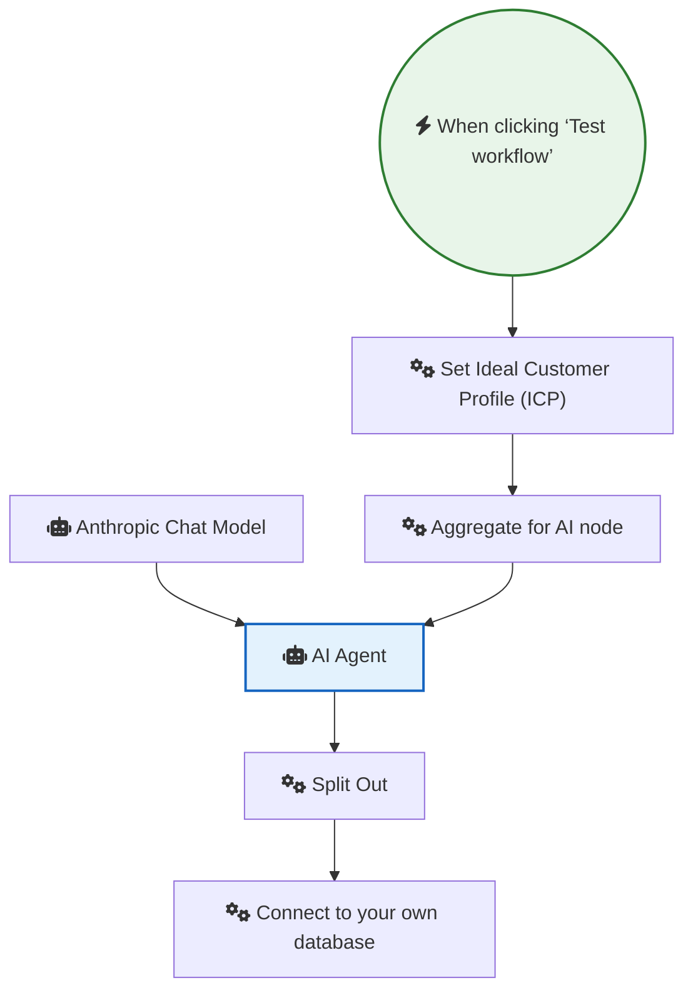

```mermaid
graph TD
    classDef trigger fill:#e8f5e9,stroke:#2e7d32,stroke-width:2px;
    classDef ai fill:#e3f2fd,stroke:#1565c0,stroke-width:2px;
    classDef logic fill:#fff3e0,stroke:#ef6c00,stroke-width:2px;

    Anthropic_Chat_Model["fas:fa-robot Anthropic Chat Model"]
    Split_Out["fas:fa-cogs Split Out"]
    Set_Ideal_Customer_Profile__ICP_["fas:fa-cogs Set Ideal Customer Profile (ICP)"]
    Aggregate_for_AI_node["fas:fa-cogs Aggregate for AI node"]
    AI_Agent["fas:fa-robot AI Agent"]:::ai
    Connect_to_your_own_database["fas:fa-cogs Connect to your own database"]
    When_clicking__Test_workflow_(("fas:fa-bolt When clicking ‘Test workflow’")):::trigger

    AI_Agent --> Split_Out
    Split_Out --> Connect_to_your_own_database
    Anthropic_Chat_Model --> AI_Agent
    Aggregate_for_AI_node --> AI_Agent
    Set_Ideal_Customer_Profile__ICP_ --> Aggregate_for_AI_node
    When_clicking__Test_workflow_ --> Set_Ideal_Customer_Profile__ICP_
```
