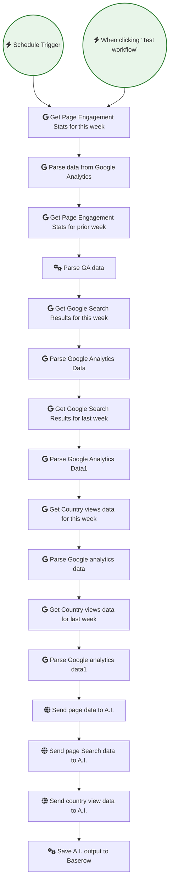

```mermaid
graph TD
    classDef trigger fill:#e8f5e9,stroke:#2e7d32,stroke-width:2px;
    classDef ai fill:#e3f2fd,stroke:#1565c0,stroke-width:2px;
    classDef logic fill:#fff3e0,stroke:#ef6c00,stroke-width:2px;

    Schedule_Trigger(("fas:fa-bolt Schedule Trigger")):::trigger
    When_clicking__Test_workflow_(("fas:fa-bolt When clicking ‘Test workflow’")):::trigger
    Get_Page_Engagement_Stats_for_this_week["fab:fa-google Get Page Engagement Stats for this week"]
    Get_Page_Engagement_Stats_for_prior_week["fab:fa-google Get Page Engagement Stats for prior week"]
    Parse_data_from_Google_Analytics["fab:fa-google Parse data from Google Analytics"]
    Parse_GA_data["fas:fa-cogs Parse GA data"]
    Get_Google_Search_Results_for_this_week["fab:fa-google Get Google Search Results for this week"]
    Get_Google_Search_Results_for_last_week["fab:fa-google Get Google Search Results for last week"]
    Parse_Google_Analytics_Data["fab:fa-google Parse Google Analytics Data"]
    Parse_Google_Analytics_Data1["fab:fa-google Parse Google Analytics Data1"]
    Get_Country_views_data_for_this_week["fab:fa-google Get Country views data for this week"]
    Get_Country_views_data_for_last_week["fab:fa-google Get Country views data for last week"]
    Parse_Google_analytics_data["fab:fa-google Parse Google analytics data"]
    Parse_Google_analytics_data1["fab:fa-google Parse Google analytics data1"]
    Send_page_data_to_A_I_["fas:fa-globe Send page data to A.I."]
    Send_page_Search_data_to_A_I_["fas:fa-globe Send page Search data to A.I."]
    Send_country_view_data_to_A_I_["fas:fa-globe Send country view data to A.I."]
    Save_A_I__output_to_Baserow["fas:fa-cogs Save A.I. output to Baserow"]

    Parse_GA_data --> Get_Google_Search_Results_for_this_week
    Schedule_Trigger --> Get_Page_Engagement_Stats_for_this_week
    Send_page_data_to_A_I_ --> Send_page_Search_data_to_A_I_
    Parse_Google_Analytics_Data --> Get_Google_Search_Results_for_last_week
    Parse_Google_analytics_data --> Get_Country_views_data_for_last_week
    Parse_Google_Analytics_Data1 --> Get_Country_views_data_for_this_week
    Parse_Google_analytics_data1 --> Send_page_data_to_A_I_
    Send_page_Search_data_to_A_I_ --> Send_country_view_data_to_A_I_
    Send_country_view_data_to_A_I_ --> Save_A_I__output_to_Baserow
    Parse_data_from_Google_Analytics --> Get_Page_Engagement_Stats_for_prior_week
    When_clicking__Test_workflow_ --> Get_Page_Engagement_Stats_for_this_week
    Get_Country_views_data_for_last_week --> Parse_Google_analytics_data1
    Get_Country_views_data_for_this_week --> Parse_Google_analytics_data
    Get_Google_Search_Results_for_last_week --> Parse_Google_Analytics_Data1
    Get_Google_Search_Results_for_this_week --> Parse_Google_Analytics_Data
    Get_Page_Engagement_Stats_for_this_week --> Parse_data_from_Google_Analytics
    Get_Page_Engagement_Stats_for_prior_week --> Parse_GA_data
```
