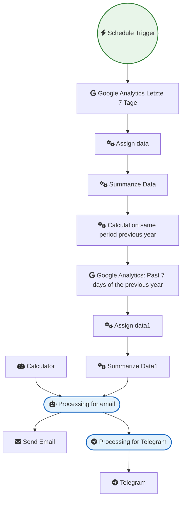

```mermaid
graph TD
    classDef trigger fill:#e8f5e9,stroke:#2e7d32,stroke-width:2px;
    classDef ai fill:#e3f2fd,stroke:#1565c0,stroke-width:2px;
    classDef logic fill:#fff3e0,stroke:#ef6c00,stroke-width:2px;

    Schedule_Trigger(("fas:fa-bolt Schedule Trigger")):::trigger
    Google_Analytics_Letzte_7_Tage["fab:fa-google Google Analytics Letzte 7 Tage"]
    Send_Email["fas:fa-envelope Send Email"]
    Telegram["fab:fa-telegram Telegram"]
    Processing_for_Telegram(["fab:fa-telegram Processing for Telegram"]):::ai
    Calculator["fas:fa-robot Calculator"]
    Google_Analytics__Past_7_days_of_the_previous_year["fab:fa-google Google Analytics: Past 7 days of the previous year"]
    Summarize_Data["fas:fa-cogs Summarize Data"]
    Summarize_Data1["fas:fa-cogs Summarize Data1"]
    Calculation_same_period_previous_year["fas:fa-cogs Calculation same period previous year"]
    Assign_data["fas:fa-cogs Assign data"]
    Assign_data1["fas:fa-cogs Assign data1"]
    Processing_for_email(["fas:fa-robot Processing for email"]):::ai

    Calculator --> Processing_for_email
    Assign_data --> Summarize_Data
    Assign_data1 --> Summarize_Data1
    Summarize_Data --> Calculation_same_period_previous_year
    Summarize_Data1 --> Processing_for_email
    Schedule_Trigger --> Google_Analytics_Letzte_7_Tage
    Processing_for_email --> Send_Email
    Processing_for_email --> Processing_for_Telegram
    Processing_for_Telegram --> Telegram
    Google_Analytics_Letzte_7_Tage --> Assign_data
    Calculation_same_period_previous_year --> Google_Analytics__Past_7_days_of_the_previous_year
    Google_Analytics__Past_7_days_of_the_previous_year --> Assign_data1
```
