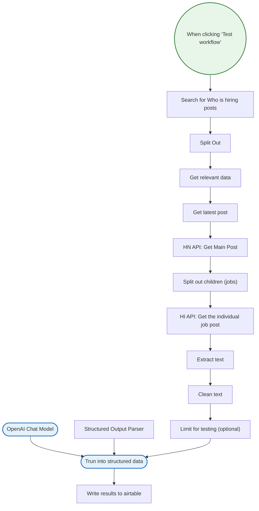

```mermaid
graph TD
    classDef trigger fill:#e8f5e9,stroke:#2e7d32,stroke-width:2px;
    classDef ai fill:#e3f2fd,stroke:#1565c0,stroke-width:2px;
    classDef logic fill:#fff3e0,stroke:#ef6c00,stroke-width:2px;

    When_clicking__Test_workflow_(("When clicking ‘Test workflow’")):::trigger
    Split_Out["Split Out"]
    OpenAI_Chat_Model(["OpenAI Chat Model"]):::ai
    Structured_Output_Parser["Structured Output Parser"]
    Search_for_Who_is_hiring_posts["Search for Who is hiring posts"]
    Get_relevant_data["Get relevant data"]
    Get_latest_post["Get latest post"]
    Split_out_children__jobs_["Split out children (jobs)"]
    Trun_into_structured_data(["Trun into structured data"]):::ai
    Extract_text["Extract text"]
    Clean_text["Clean text"]
    Limit_for_testing__optional_["Limit for testing (optional)"]
    Write_results_to_airtable["Write results to airtable"]
    HI_API__Get_the_individual_job_post["HI API: Get the individual job post"]
    HN_API__Get_Main_Post["HN API: Get Main Post"]

    Split_Out --> Get_relevant_data
    Clean_text --> Limit_for_testing__optional_
    Extract_text --> Clean_text
    Get_latest_post --> HN_API__Get_Main_Post
    Get_relevant_data --> Get_latest_post
    OpenAI_Chat_Model --> Trun_into_structured_data
    HN_API__Get_Main_Post --> Split_out_children__jobs_
    Structured_Output_Parser --> Trun_into_structured_data
    Split_out_children__jobs_ --> HI_API__Get_the_individual_job_post
    Trun_into_structured_data --> Write_results_to_airtable
    Limit_for_testing__optional_ --> Trun_into_structured_data
    Search_for_Who_is_hiring_posts --> Split_Out
    When_clicking__Test_workflow_ --> Search_for_Who_is_hiring_posts
    HI_API__Get_the_individual_job_post --> Extract_text
```
