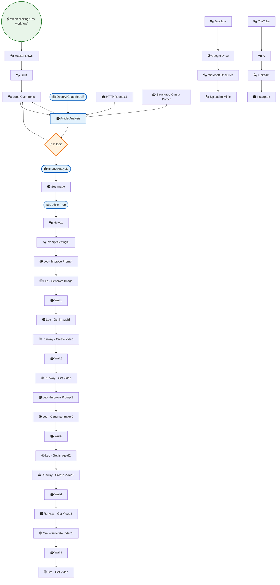

```mermaid
graph TD
    classDef trigger fill:#e8f5e9,stroke:#2e7d32,stroke-width:2px;
    classDef ai fill:#e3f2fd,stroke:#1565c0,stroke-width:2px;
    classDef logic fill:#fff3e0,stroke:#ef6c00,stroke-width:2px;

    When_clicking__Test_workflow_(("fas:fa-bolt When clicking ‘Test workflow’")):::trigger
    Hacker_News["fas:fa-cogs Hacker News"]
    Loop_Over_Items["fas:fa-cogs Loop Over Items"]
    OpenAI_Chat_Model3(["fas:fa-robot OpenAI Chat Model3"]):::ai
    HTTP_Request1["fas:fa-robot HTTP Request1"]
    Structured_Output_Parser["fas:fa-robot Structured Output Parser"]
    Upload_to_Minio["fas:fa-cogs Upload to Minio"]
    News1["fas:fa-cogs News1"]
    Leo___Improve_Prompt["fas:fa-globe Leo - Improve Prompt"]
    Leo___Get_imageId["fas:fa-globe Leo - Get imageId"]
    Runway___Create_Video["fas:fa-globe Runway - Create Video"]
    Runway___Get_Video["fas:fa-globe Runway - Get Video"]
    Wait2["fas:fa-robot Wait2"]
    If_Topic{"fas:fa-code-branch If Topic"}:::logic
    Get_Image["fas:fa-globe Get Image"]
    Prompt_Settings1["fas:fa-cogs Prompt Settings1"]
    Leo___Generate_Image["fas:fa-globe Leo - Generate Image"]
    Wait1["fas:fa-robot Wait1"]
    Limit["fas:fa-cogs Limit"]
    Image_Analysis(["fas:fa-robot Image Analysis"]):::ai
    Wait3["fas:fa-robot Wait3"]
    Article_Analysis["fas:fa-robot Article Analysis"]:::ai
    Dropbox["fas:fa-cogs Dropbox"]
    Google_Drive["fab:fa-google Google Drive"]
    Microsoft_OneDrive["fas:fa-cogs Microsoft OneDrive"]
    YouTube["fas:fa-cogs YouTube"]
    X["fas:fa-cogs X"]
    Instagram["fas:fa-globe Instagram"]
    LinkedIn["fas:fa-cogs LinkedIn"]
    Leo___Improve_Prompt2["fas:fa-globe Leo - Improve Prompt2"]
    Wait4["fas:fa-robot Wait4"]
    Wait6["fas:fa-robot Wait6"]
    Leo___Generate_Image2["fas:fa-globe Leo - Generate Image2"]
    Leo___Get_imageId2["fas:fa-globe Leo - Get imageId2"]
    Runway___Create_Video2["fas:fa-globe Runway - Create Video2"]
    Runway___Get_Video2["fas:fa-globe Runway - Get Video2"]
    Cre___Generate_Video1["fas:fa-globe Cre - Generate Video1"]
    Cre___Get_Video["fas:fa-globe Cre - Get Video"]
    Article_Prep(["fas:fa-robot Article Prep"]):::ai

    X --> LinkedIn
    Limit --> Loop_Over_Items
    News1 --> Prompt_Settings1
    Wait1 --> Leo___Get_imageId
    Wait2 --> Runway___Get_Video
    Wait3 --> Cre___Get_Video
    Wait4 --> Runway___Get_Video2
    Wait6 --> Leo___Get_imageId2
    Dropbox --> Google_Drive
    YouTube --> X
    If_Topic --> Image_Analysis
    If_Topic --> Loop_Over_Items
    LinkedIn --> Instagram
    Get_Image --> Article_Prep
    Hacker_News --> Limit
    Article_Prep --> News1
    Google_Drive --> Microsoft_OneDrive
    HTTP_Request1 --> Article_Analysis
    Image_Analysis --> Get_Image
    Loop_Over_Items --> Article_Analysis
    Article_Analysis --> If_Topic
    Article_Analysis --> Loop_Over_Items
    Prompt_Settings1 --> Leo___Improve_Prompt
    Leo___Get_imageId --> Runway___Create_Video
    Leo___Get_imageId2 --> Runway___Create_Video2
    Microsoft_OneDrive --> Upload_to_Minio
    OpenAI_Chat_Model3 --> Article_Analysis
    Runway___Get_Video --> Leo___Improve_Prompt2
    Runway___Get_Video2 --> Cre___Generate_Video1
    Leo___Generate_Image --> Wait1
    Leo___Improve_Prompt --> Leo___Generate_Image
    Cre___Generate_Video1 --> Wait3
    Leo___Generate_Image2 --> Wait6
    Leo___Improve_Prompt2 --> Leo___Generate_Image2
    Runway___Create_Video --> Wait2
    Runway___Create_Video2 --> Wait4
    Structured_Output_Parser --> Article_Analysis
    When_clicking__Test_workflow_ --> Hacker_News
```
