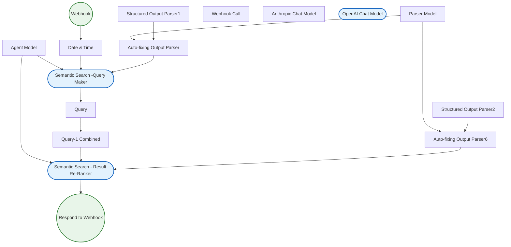

```mermaid
graph TD
    classDef trigger fill:#e8f5e9,stroke:#2e7d32,stroke-width:2px;
    classDef ai fill:#e3f2fd,stroke:#1565c0,stroke-width:2px;
    classDef logic fill:#fff3e0,stroke:#ef6c00,stroke-width:2px;

    Date___Time["Date & Time"]
    Webhook(("Webhook")):::trigger
    Auto_fixing_Output_Parser6["Auto-fixing Output Parser6"]
    Auto_fixing_Output_Parser["Auto-fixing Output Parser"]
    Structured_Output_Parser1["Structured Output Parser1"]
    Query_1_Combined["Query-1 Combined"]
    Respond_to_Webhook(("Respond to Webhook")):::trigger
    Semantic_Search___Result_Re_Ranker(["Semantic Search - Result Re-Ranker"]):::ai
    Query["Query"]
    Webhook_Call["Webhook Call"]
    Semantic_Search__Query_Maker(["Semantic Search -Query Maker"]):::ai
    Anthropic_Chat_Model["Anthropic Chat Model"]
    OpenAI_Chat_Model(["OpenAI Chat Model"]):::ai
    Structured_Output_Parser2["Structured Output Parser2"]
    Parser_Model["Parser Model"]
    Agent_Model["Agent Model"]

    Query --> Query_1_Combined
    Webhook --> Date___Time
    Agent_Model --> Semantic_Search___Result_Re_Ranker
    Agent_Model --> Semantic_Search__Query_Maker
    Date___Time --> Semantic_Search__Query_Maker
    Parser_Model --> Auto_fixing_Output_Parser6
    Parser_Model --> Auto_fixing_Output_Parser
    Query_1_Combined --> Semantic_Search___Result_Re_Ranker
    Auto_fixing_Output_Parser --> Semantic_Search__Query_Maker
    Structured_Output_Parser1 --> Auto_fixing_Output_Parser
    Structured_Output_Parser2 --> Auto_fixing_Output_Parser6
    Auto_fixing_Output_Parser6 --> Semantic_Search___Result_Re_Ranker
    Semantic_Search__Query_Maker --> Query
    Semantic_Search___Result_Re_Ranker --> Respond_to_Webhook
```
