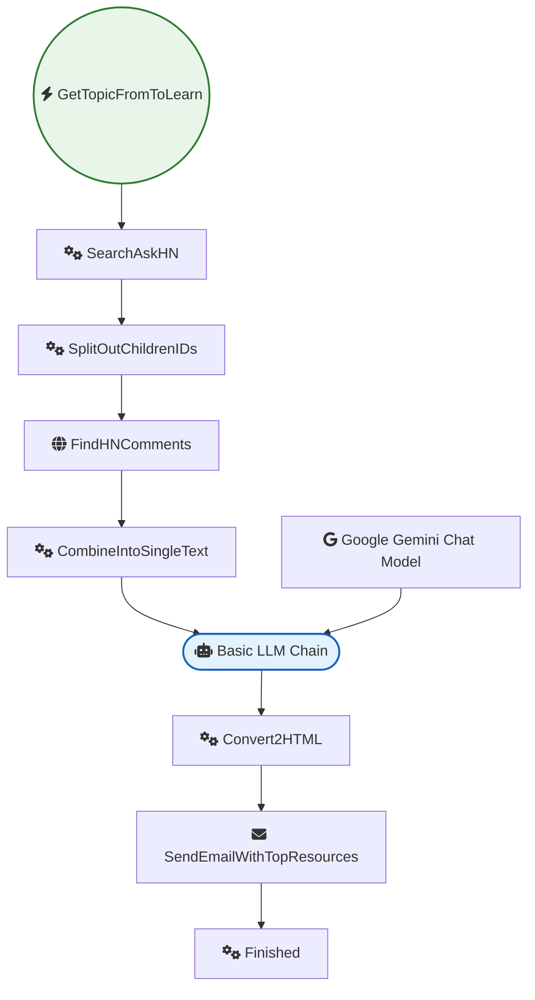

```mermaid
graph TD
    classDef trigger fill:#e8f5e9,stroke:#2e7d32,stroke-width:2px;
    classDef ai fill:#e3f2fd,stroke:#1565c0,stroke-width:2px;
    classDef logic fill:#fff3e0,stroke:#ef6c00,stroke-width:2px;

    Google_Gemini_Chat_Model["fab:fa-google Google Gemini Chat Model"]
    Basic_LLM_Chain(["fas:fa-robot Basic LLM Chain"]):::ai
    SearchAskHN["fas:fa-cogs SearchAskHN"]
    FindHNComments["fas:fa-globe FindHNComments"]
    CombineIntoSingleText["fas:fa-cogs CombineIntoSingleText"]
    SplitOutChildrenIDs["fas:fa-cogs SplitOutChildrenIDs"]
    GetTopicFromToLearn(("fas:fa-bolt GetTopicFromToLearn")):::trigger
    SendEmailWithTopResources["fas:fa-envelope SendEmailWithTopResources"]
    Convert2HTML["fas:fa-cogs Convert2HTML"]
    Finished["fas:fa-cogs Finished"]

    SearchAskHN --> SplitOutChildrenIDs
    Convert2HTML --> SendEmailWithTopResources
    FindHNComments --> CombineIntoSingleText
    Basic_LLM_Chain --> Convert2HTML
    GetTopicFromToLearn --> SearchAskHN
    SplitOutChildrenIDs --> FindHNComments
    CombineIntoSingleText --> Basic_LLM_Chain
    Google_Gemini_Chat_Model --> Basic_LLM_Chain
    SendEmailWithTopResources --> Finished
```
