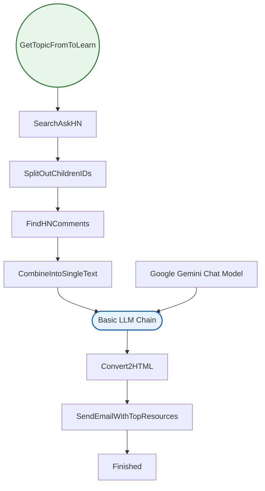

```mermaid
graph TD
    classDef trigger fill:#e8f5e9,stroke:#2e7d32,stroke-width:2px;
    classDef ai fill:#e3f2fd,stroke:#1565c0,stroke-width:2px;
    classDef logic fill:#fff3e0,stroke:#ef6c00,stroke-width:2px;

    Google_Gemini_Chat_Model["Google Gemini Chat Model"]
    Basic_LLM_Chain(["Basic LLM Chain"]):::ai
    SearchAskHN["SearchAskHN"]
    FindHNComments["FindHNComments"]
    CombineIntoSingleText["CombineIntoSingleText"]
    SplitOutChildrenIDs["SplitOutChildrenIDs"]
    GetTopicFromToLearn(("GetTopicFromToLearn")):::trigger
    SendEmailWithTopResources["SendEmailWithTopResources"]
    Convert2HTML["Convert2HTML"]
    Finished["Finished"]

    SearchAskHN --> SplitOutChildrenIDs
    Convert2HTML --> SendEmailWithTopResources
    FindHNComments --> CombineIntoSingleText
    Basic_LLM_Chain --> Convert2HTML
    GetTopicFromToLearn --> SearchAskHN
    SplitOutChildrenIDs --> FindHNComments
    CombineIntoSingleText --> Basic_LLM_Chain
    Google_Gemini_Chat_Model --> Basic_LLM_Chain
    SendEmailWithTopResources --> Finished
```
