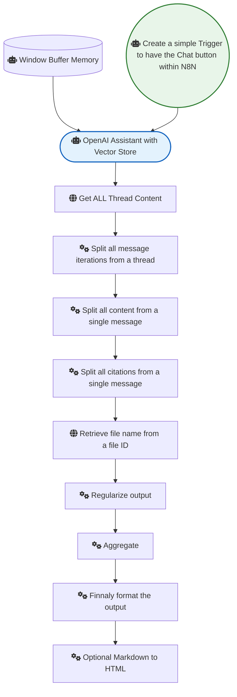

```mermaid
graph TD
    classDef trigger fill:#e8f5e9,stroke:#2e7d32,stroke-width:2px;
    classDef ai fill:#e3f2fd,stroke:#1565c0,stroke-width:2px;
    classDef logic fill:#fff3e0,stroke:#ef6c00,stroke-width:2px;

    Aggregate["fas:fa-cogs Aggregate"]
    Window_Buffer_Memory[("fas:fa-robot Window Buffer Memory")]
    Create_a_simple_Trigger_to_have_the_Chat_button_within_N8N(("fas:fa-robot Create a simple Trigger to have the Chat button within N8N")):::trigger
    OpenAI_Assistant_with_Vector_Store(["fas:fa-robot OpenAI Assistant with Vector Store"]):::ai
    Get_ALL_Thread_Content["fas:fa-globe Get ALL Thread Content"]
    Split_all_message_iterations_from_a_thread["fas:fa-cogs Split all message iterations from a thread"]
    Split_all_content_from_a_single_message["fas:fa-cogs Split all content from a single message"]
    Split_all_citations_from_a_single_message["fas:fa-cogs Split all citations from a single message"]
    Retrieve_file_name_from_a_file_ID["fas:fa-globe Retrieve file name from a file ID"]
    Regularize_output["fas:fa-cogs Regularize output"]
    Optional_Markdown_to_HTML["fas:fa-cogs Optional Markdown to HTML"]
    Finnaly_format_the_output["fas:fa-cogs Finnaly format the output"]

    Aggregate --> Finnaly_format_the_output
    Regularize_output --> Aggregate
    Window_Buffer_Memory --> OpenAI_Assistant_with_Vector_Store
    Get_ALL_Thread_Content --> Split_all_message_iterations_from_a_thread
    Finnaly_format_the_output --> Optional_Markdown_to_HTML
    Retrieve_file_name_from_a_file_ID --> Regularize_output
    OpenAI_Assistant_with_Vector_Store --> Get_ALL_Thread_Content
    Split_all_content_from_a_single_message --> Split_all_citations_from_a_single_message
    Split_all_citations_from_a_single_message --> Retrieve_file_name_from_a_file_ID
    Split_all_message_iterations_from_a_thread --> Split_all_content_from_a_single_message
    Create_a_simple_Trigger_to_have_the_Chat_button_within_N8N --> OpenAI_Assistant_with_Vector_Store
```
