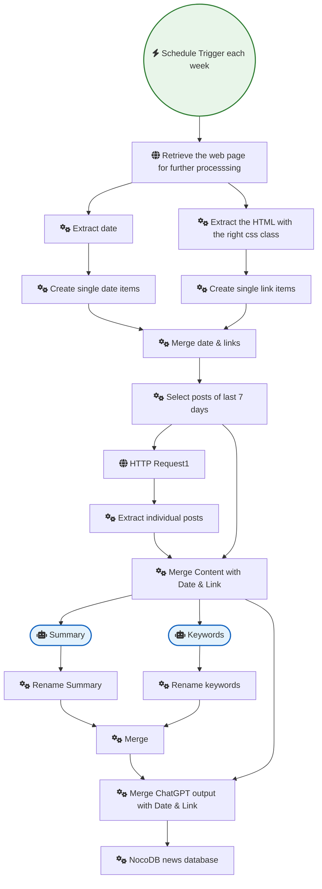

```mermaid
graph TD
    classDef trigger fill:#e8f5e9,stroke:#2e7d32,stroke-width:2px;
    classDef ai fill:#e3f2fd,stroke:#1565c0,stroke-width:2px;
    classDef logic fill:#fff3e0,stroke:#ef6c00,stroke-width:2px;

    Extract_the_HTML_with_the_right_css_class["fas:fa-cogs Extract the HTML with the right css class"]
    Summary(["fas:fa-robot Summary"]):::ai
    Keywords(["fas:fa-robot Keywords"]):::ai
    Rename_keywords["fas:fa-cogs Rename keywords"]
    Rename_Summary["fas:fa-cogs Rename Summary"]
    Merge["fas:fa-cogs Merge"]
    Extract_date["fas:fa-cogs Extract date"]
    Select_posts_of_last_7_days["fas:fa-cogs Select posts of last 7 days"]
    Merge_date___links["fas:fa-cogs Merge date & links"]
    HTTP_Request1["fas:fa-globe HTTP Request1"]
    Merge_Content_with_Date___Link["fas:fa-cogs Merge Content with Date & Link"]
    Extract_individual_posts["fas:fa-cogs Extract individual posts"]
    Merge_ChatGPT_output_with_Date___Link["fas:fa-cogs Merge ChatGPT output with Date & Link"]
    Retrieve_the_web_page_for_further_processsing["fas:fa-globe Retrieve the web page for further processsing"]
    Schedule_Trigger_each_week(("fas:fa-bolt Schedule Trigger each week")):::trigger
    NocoDB_news_database["fas:fa-cogs NocoDB news database"]
    Create_single_link_items["fas:fa-cogs Create single link items"]
    Create_single_date_items["fas:fa-cogs Create single date items"]

    Merge --> Merge_ChatGPT_output_with_Date___Link
    Summary --> Rename_Summary
    Keywords --> Rename_keywords
    Extract_date --> Create_single_date_items
    HTTP_Request1 --> Extract_individual_posts
    Rename_Summary --> Merge
    Rename_keywords --> Merge
    Merge_date___links --> Select_posts_of_last_7_days
    Create_single_date_items --> Merge_date___links
    Create_single_link_items --> Merge_date___links
    Extract_individual_posts --> Merge_Content_with_Date___Link
    Schedule_Trigger_each_week --> Retrieve_the_web_page_for_further_processsing
    Select_posts_of_last_7_days --> Merge_Content_with_Date___Link
    Select_posts_of_last_7_days --> HTTP_Request1
    Merge_Content_with_Date___Link --> Summary
    Merge_Content_with_Date___Link --> Keywords
    Merge_Content_with_Date___Link --> Merge_ChatGPT_output_with_Date___Link
    Merge_ChatGPT_output_with_Date___Link --> NocoDB_news_database
    Extract_the_HTML_with_the_right_css_class --> Create_single_link_items
    Retrieve_the_web_page_for_further_processsing --> Extract_the_HTML_with_the_right_css_class
    Retrieve_the_web_page_for_further_processsing --> Extract_date
```
