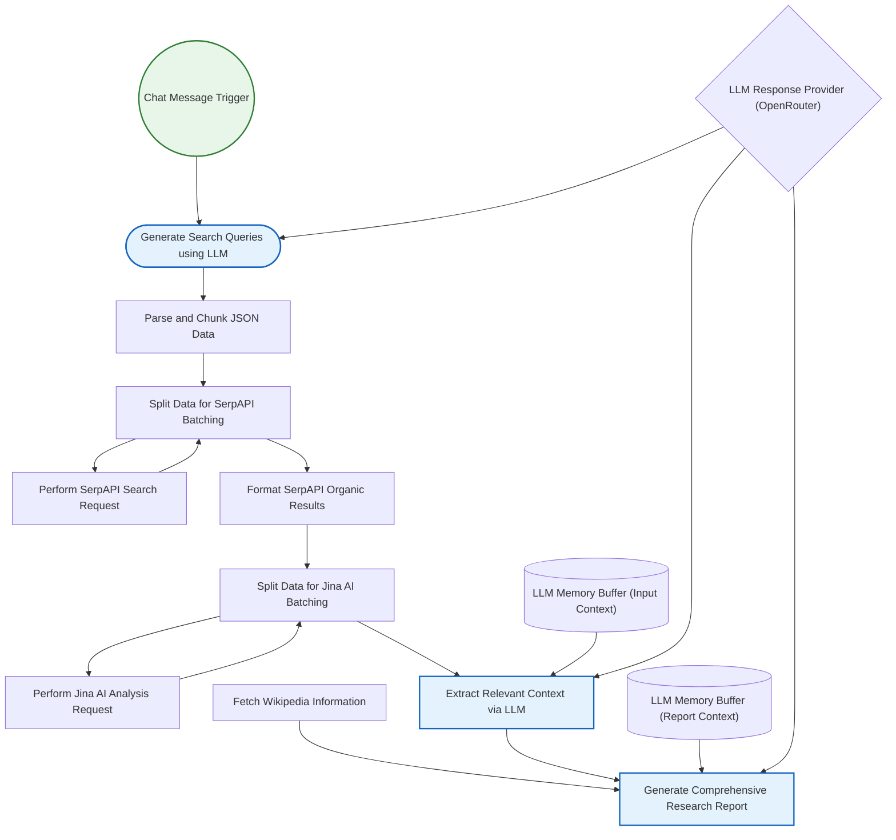

```mermaid
graph TD
    classDef trigger fill:#e8f5e9,stroke:#2e7d32,stroke-width:2px;
    classDef ai fill:#e3f2fd,stroke:#1565c0,stroke-width:2px;
    classDef logic fill:#fff3e0,stroke:#ef6c00,stroke-width:2px;

    Chat_Message_Trigger(("Chat Message Trigger")):::trigger
    Generate_Search_Queries_using_LLM(["Generate Search Queries using LLM"]):::ai
    LLM_Response_Provider__OpenRouter_{"LLM Response Provider (OpenRouter)"}
    Parse_and_Chunk_JSON_Data["Parse and Chunk JSON Data"]
    Perform_SerpAPI_Search_Request["Perform SerpAPI Search Request"]
    Perform_Jina_AI_Analysis_Request["Perform Jina AI Analysis Request"]
    Format_SerpAPI_Organic_Results["Format SerpAPI Organic Results"]
    Extract_Relevant_Context_via_LLM["Extract Relevant Context via LLM"]:::ai
    Generate_Comprehensive_Research_Report["Generate Comprehensive Research Report"]:::ai
    Split_Data_for_SerpAPI_Batching["Split Data for SerpAPI Batching"]
    Split_Data_for_Jina_AI_Batching["Split Data for Jina AI Batching"]
    LLM_Memory_Buffer__Input_Context_[("LLM Memory Buffer (Input Context)")]
    LLM_Memory_Buffer__Report_Context_[("LLM Memory Buffer (Report Context)")]
    Fetch_Wikipedia_Information["Fetch Wikipedia Information"]

    Chat_Message_Trigger --> Generate_Search_Queries_using_LLM
    Parse_and_Chunk_JSON_Data --> Split_Data_for_SerpAPI_Batching
    Fetch_Wikipedia_Information --> Generate_Comprehensive_Research_Report
    Format_SerpAPI_Organic_Results --> Split_Data_for_Jina_AI_Batching
    Perform_SerpAPI_Search_Request --> Split_Data_for_SerpAPI_Batching
    Split_Data_for_Jina_AI_Batching --> Extract_Relevant_Context_via_LLM
    Split_Data_for_Jina_AI_Batching --> Perform_Jina_AI_Analysis_Request
    Split_Data_for_SerpAPI_Batching --> Format_SerpAPI_Organic_Results
    Split_Data_for_SerpAPI_Batching --> Perform_SerpAPI_Search_Request
    Extract_Relevant_Context_via_LLM --> Generate_Comprehensive_Research_Report
    Perform_Jina_AI_Analysis_Request --> Split_Data_for_Jina_AI_Batching
    Generate_Search_Queries_using_LLM --> Parse_and_Chunk_JSON_Data
    LLM_Memory_Buffer__Input_Context_ --> Extract_Relevant_Context_via_LLM
    LLM_Memory_Buffer__Report_Context_ --> Generate_Comprehensive_Research_Report
    LLM_Response_Provider__OpenRouter_ --> Generate_Search_Queries_using_LLM
    LLM_Response_Provider__OpenRouter_ --> Extract_Relevant_Context_via_LLM
    LLM_Response_Provider__OpenRouter_ --> Generate_Comprehensive_Research_Report
```
