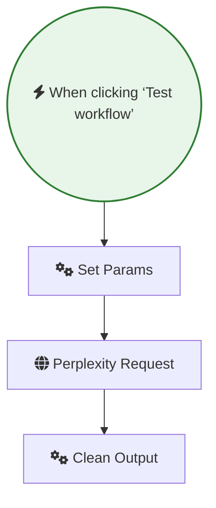

```mermaid
graph TD
    classDef trigger fill:#e8f5e9,stroke:#2e7d32,stroke-width:2px;
    classDef ai fill:#e3f2fd,stroke:#1565c0,stroke-width:2px;
    classDef logic fill:#fff3e0,stroke:#ef6c00,stroke-width:2px;

    When_clicking__Test_workflow_(("fas:fa-bolt When clicking ‘Test workflow’")):::trigger
    Set_Params["fas:fa-cogs Set Params"]
    Clean_Output["fas:fa-cogs Clean Output"]
    Perplexity_Request["fas:fa-globe Perplexity Request"]

    Set_Params --> Perplexity_Request
    Perplexity_Request --> Clean_Output
    When_clicking__Test_workflow_ --> Set_Params
```
