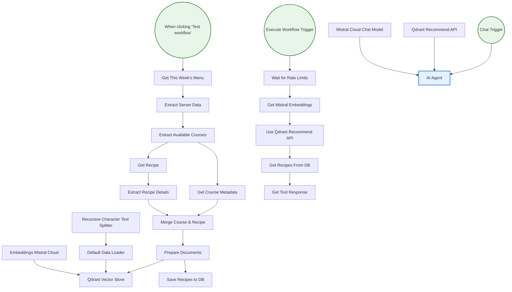

```mermaid
graph TD
    classDef trigger fill:#e8f5e9,stroke:#2e7d32,stroke-width:2px;
    classDef ai fill:#e3f2fd,stroke:#1565c0,stroke-width:2px;
    classDef logic fill:#fff3e0,stroke:#ef6c00,stroke-width:2px;

    When_clicking__Test_workflow_(("When clicking 'Test workflow'")):::trigger
    Get_This_Week_s_Menu["Get This Week's Menu"]
    Extract_Available_Courses["Extract Available Courses"]
    Extract_Server_Data["Extract Server Data"]
    Get_Course_Metadata["Get Course Metadata"]
    Get_Recipe["Get Recipe"]
    Embeddings_Mistral_Cloud["Embeddings Mistral Cloud"]
    Default_Data_Loader["Default Data Loader"]
    Merge_Course___Recipe["Merge Course & Recipe"]
    Prepare_Documents["Prepare Documents"]
    Recursive_Character_Text_Splitter["Recursive Character Text Splitter"]
    Chat_Trigger(("Chat Trigger")):::trigger
    Extract_Recipe_Details["Extract Recipe Details"]
    Qdrant_Recommend_API["Qdrant Recommend API"]
    Execute_Workflow_Trigger(("Execute Workflow Trigger")):::trigger
    Mistral_Cloud_Chat_Model["Mistral Cloud Chat Model"]
    Get_Tool_Response["Get Tool Response"]
    Wait_for_Rate_Limits["Wait for Rate Limits"]
    Get_Mistral_Embeddings["Get Mistral Embeddings"]
    Use_Qdrant_Recommend_API["Use Qdrant Recommend API"]
    Get_Recipes_From_DB["Get Recipes From DB"]
    Save_Recipes_to_DB["Save Recipes to DB"]
    AI_Agent["AI Agent"]:::ai
    Qdrant_Vector_Store["Qdrant Vector Store"]

    Get_Recipe --> Extract_Recipe_Details
    Chat_Trigger --> AI_Agent
    Prepare_Documents --> Qdrant_Vector_Store
    Prepare_Documents --> Save_Recipes_to_DB
    Default_Data_Loader --> Qdrant_Vector_Store
    Extract_Server_Data --> Extract_Available_Courses
    Get_Course_Metadata --> Merge_Course___Recipe
    Get_Recipes_From_DB --> Get_Tool_Response
    Get_This_Week_s_Menu --> Extract_Server_Data
    Qdrant_Recommend_API --> AI_Agent
    Wait_for_Rate_Limits --> Get_Mistral_Embeddings
    Merge_Course___Recipe --> Prepare_Documents
    Extract_Recipe_Details --> Merge_Course___Recipe
    Get_Mistral_Embeddings --> Use_Qdrant_Recommend_API
    Embeddings_Mistral_Cloud --> Qdrant_Vector_Store
    Execute_Workflow_Trigger --> Wait_for_Rate_Limits
    Mistral_Cloud_Chat_Model --> AI_Agent
    Use_Qdrant_Recommend_API --> Get_Recipes_From_DB
    Extract_Available_Courses --> Get_Course_Metadata
    Extract_Available_Courses --> Get_Recipe
    When_clicking__Test_workflow_ --> Get_This_Week_s_Menu
    Recursive_Character_Text_Splitter --> Default_Data_Loader
```
