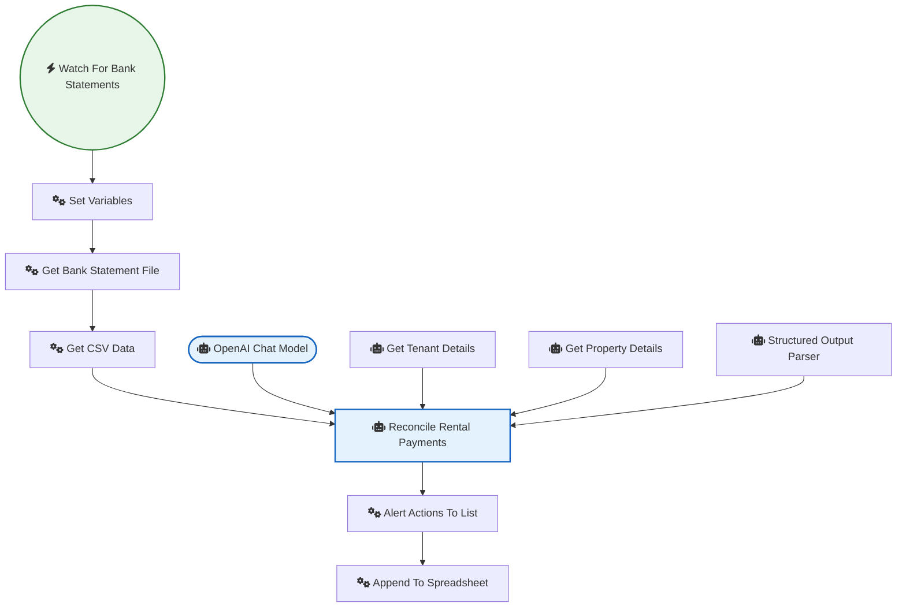

```mermaid
graph TD
    classDef trigger fill:#e8f5e9,stroke:#2e7d32,stroke-width:2px;
    classDef ai fill:#e3f2fd,stroke:#1565c0,stroke-width:2px;
    classDef logic fill:#fff3e0,stroke:#ef6c00,stroke-width:2px;

    Watch_For_Bank_Statements(("fas:fa-bolt Watch For Bank Statements")):::trigger
    Get_Tenant_Details["fas:fa-robot Get Tenant Details"]
    Structured_Output_Parser["fas:fa-robot Structured Output Parser"]
    Get_Bank_Statement_File["fas:fa-cogs Get Bank Statement File"]
    Get_CSV_Data["fas:fa-cogs Get CSV Data"]
    Alert_Actions_To_List["fas:fa-cogs Alert Actions To List"]
    Get_Property_Details["fas:fa-robot Get Property Details"]
    Set_Variables["fas:fa-cogs Set Variables"]
    Append_To_Spreadsheet["fas:fa-cogs Append To Spreadsheet"]
    OpenAI_Chat_Model(["fas:fa-robot OpenAI Chat Model"]):::ai
    Reconcile_Rental_Payments["fas:fa-robot Reconcile Rental Payments"]:::ai

    Get_CSV_Data --> Reconcile_Rental_Payments
    Set_Variables --> Get_Bank_Statement_File
    OpenAI_Chat_Model --> Reconcile_Rental_Payments
    Get_Tenant_Details --> Reconcile_Rental_Payments
    Get_Property_Details --> Reconcile_Rental_Payments
    Alert_Actions_To_List --> Append_To_Spreadsheet
    Get_Bank_Statement_File --> Get_CSV_Data
    Structured_Output_Parser --> Reconcile_Rental_Payments
    Reconcile_Rental_Payments --> Alert_Actions_To_List
    Watch_For_Bank_Statements --> Set_Variables
```
