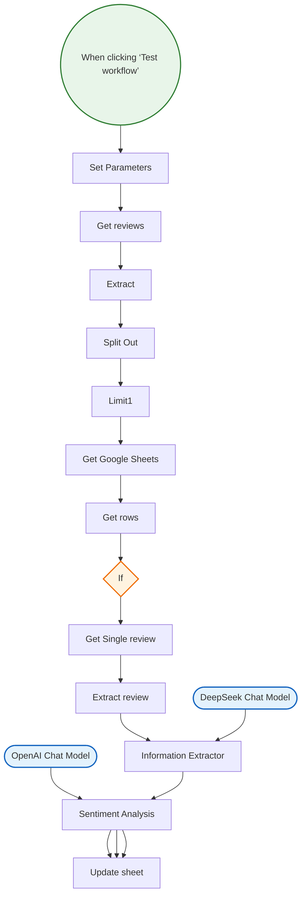

```mermaid
graph TD
    classDef trigger fill:#e8f5e9,stroke:#2e7d32,stroke-width:2px;
    classDef ai fill:#e3f2fd,stroke:#1565c0,stroke-width:2px;
    classDef logic fill:#fff3e0,stroke:#ef6c00,stroke-width:2px;

    Split_Out["Split Out"]
    Information_Extractor["Information Extractor"]
    If{"If"}:::logic
    When_clicking__Test_workflow_(("When clicking ‘Test workflow’")):::trigger
    Limit1["Limit1"]
    Set_Parameters["Set Parameters"]
    Get_reviews["Get reviews"]
    Extract["Extract"]
    Get_rows["Get rows"]
    Get_Google_Sheets["Get Google Sheets"]
    Get_Single_review["Get Single review"]
    Extract_review["Extract review"]
    Update_sheet["Update sheet"]
    Sentiment_Analysis["Sentiment Analysis"]
    DeepSeek_Chat_Model(["DeepSeek Chat Model"]):::ai
    OpenAI_Chat_Model(["OpenAI Chat Model"]):::ai

    If --> Get_Single_review
    Limit1 --> Get_Google_Sheets
    Extract --> Split_Out
    Get_rows --> If
    Split_Out --> Limit1
    Get_reviews --> Extract
    Extract_review --> Information_Extractor
    Set_Parameters --> Get_reviews
    Get_Google_Sheets --> Get_rows
    Get_Single_review --> Extract_review
    OpenAI_Chat_Model --> Sentiment_Analysis
    Sentiment_Analysis --> Update_sheet
    Sentiment_Analysis --> Update_sheet
    Sentiment_Analysis --> Update_sheet
    DeepSeek_Chat_Model --> Information_Extractor
    Information_Extractor --> Sentiment_Analysis
    When_clicking__Test_workflow_ --> Set_Parameters
```
