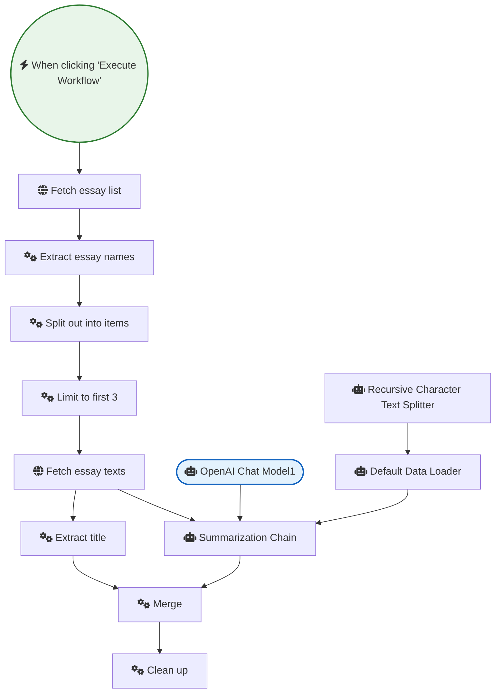

```mermaid
graph TD
    classDef trigger fill:#e8f5e9,stroke:#2e7d32,stroke-width:2px;
    classDef ai fill:#e3f2fd,stroke:#1565c0,stroke-width:2px;
    classDef logic fill:#fff3e0,stroke:#ef6c00,stroke-width:2px;

    When_clicking__Execute_Workflow_(("fas:fa-bolt When clicking 'Execute Workflow'")):::trigger
    Fetch_essay_list["fas:fa-globe Fetch essay list"]
    Extract_essay_names["fas:fa-cogs Extract essay names"]
    Fetch_essay_texts["fas:fa-globe Fetch essay texts"]
    Extract_title["fas:fa-cogs Extract title"]
    Clean_up["fas:fa-cogs Clean up"]
    Split_out_into_items["fas:fa-cogs Split out into items"]
    Limit_to_first_3["fas:fa-cogs Limit to first 3"]
    Default_Data_Loader["fas:fa-robot Default Data Loader"]
    Recursive_Character_Text_Splitter["fas:fa-robot Recursive Character Text Splitter"]
    OpenAI_Chat_Model1(["fas:fa-robot OpenAI Chat Model1"]):::ai
    Merge["fas:fa-cogs Merge"]
    Summarization_Chain["fas:fa-robot Summarization Chain"]

    Merge --> Clean_up
    Extract_title --> Merge
    Fetch_essay_list --> Extract_essay_names
    Limit_to_first_3 --> Fetch_essay_texts
    Fetch_essay_texts --> Extract_title
    Fetch_essay_texts --> Summarization_Chain
    OpenAI_Chat_Model1 --> Summarization_Chain
    Default_Data_Loader --> Summarization_Chain
    Extract_essay_names --> Split_out_into_items
    Summarization_Chain --> Merge
    Split_out_into_items --> Limit_to_first_3
    When_clicking__Execute_Workflow_ --> Fetch_essay_list
    Recursive_Character_Text_Splitter --> Default_Data_Loader
```
