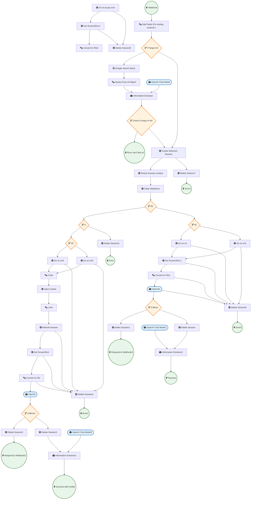

```mermaid
graph TD
    classDef trigger fill:#e8f5e9,stroke:#2e7d32,stroke-width:2px;
    classDef ai fill:#e3f2fd,stroke:#1565c0,stroke-width:2px;
    classDef logic fill:#fff3e0,stroke:#ef6c00,stroke-width:2px;

    Extract_First_Url_Match["fas:fa-cogs Extract First Url Match"]
    OpenAI_Chat_Model(["fas:fa-robot OpenAI Chat Model"]):::ai
    Clean_Webdriver_["fas:fa-globe Clean Webdriver "]
    Delete_Session["fas:fa-globe Delete Session"]
    Delete_Session2["fas:fa-globe Delete Session2"]
    If_Block1{"fas:fa-code-branch If Block1"}:::logic
    Delete_Session3["fas:fa-globe Delete Session3"]
    Limit["fas:fa-cogs Limit"]
    Delete_Session1["fas:fa-globe Delete Session1"]
    Delete_Session4["fas:fa-globe Delete Session4"]
    Success_with_cookie(("fas:fa-bolt Success with cookie")):::trigger
    Respond_to_Webhook2(("fas:fa-bolt Respond to Webhook2")):::trigger
    Code["fas:fa-cogs Code"]
    Delete_Session5["fas:fa-globe Delete Session5"]
    Error(("fas:fa-bolt Error")):::trigger
    Error1(("fas:fa-bolt Error1")):::trigger
    Error2(("fas:fa-bolt Error2")):::trigger
    If{"fas:fa-code-branch If"}:::logic
    Inject_Cookie["fas:fa-globe Inject Cookie"]
    Respond_to_Webhook3(("fas:fa-bolt Respond to Webhook3")):::trigger
    Success(("fas:fa-bolt Success")):::trigger
    Go_on_url["fas:fa-globe Go on url"]
    Delete_Session6["fas:fa-globe Delete Session6"]
    Error3(("fas:fa-bolt Error3")):::trigger
    Information_Extractor["fas:fa-robot Information Extractor"]
    Check_if_empty_of_NA{"fas:fa-code-branch Check if empty of NA"}:::logic
    If_Block{"fas:fa-code-branch If Block"}:::logic
    Google_search_Query_["fab:fa-google Google search Query "]
    Create_Selenium_Session["fas:fa-globe Create Selenium Session"]
    Get_ScreenShot_1["fas:fa-globe Get ScreenShot 1"]
    Refresh_browser["fas:fa-globe Refresh browser"]
    Get_ScreenShot_["fas:fa-globe Get ScreenShot "]
    Convert_to_File["fas:fa-cogs Convert to File"]
    Convert_to_File1["fas:fa-cogs Convert to File1"]
    Delete_Session7["fas:fa-globe Delete Session7"]
    Edit_Fields__For_testing_prupose__["fas:fa-cogs Edit Fields (For testing prupose )"]
    Get_ScreenShot_2["fas:fa-globe Get ScreenShot 2"]
    Convert_to_File2["fas:fa-cogs Convert to File2"]
    Go_on_ip_api_com["fas:fa-globe Go on ip-api.com"]
    Delete_Session8["fas:fa-globe Delete Session8"]
    Error_can_t_find_url(("fas:fa-bolt Error can't find url")):::trigger
    Resize_browser_window["fas:fa-globe Resize browser window"]
    OpenAI(["fas:fa-robot OpenAI"]):::ai
    OpenAI1(["fas:fa-robot OpenAI1"]):::ai
    Information_Extractor1["fas:fa-robot Information Extractor1"]
    OpenAI_Chat_Model1(["fas:fa-robot OpenAI Chat Model1"]):::ai
    Information_Extractor2["fas:fa-robot Information Extractor2"]
    OpenAI_Chat_Model2(["fas:fa-robot OpenAI Chat Model2"]):::ai
    Webhook(("fas:fa-bolt Webhook")):::trigger
    If_Target_Url{"fas:fa-code-branch If Target Url"}:::logic
    If1{"fas:fa-code-branch If1"}:::logic
    Go_on_url1["fas:fa-globe Go on url1"]
    If2{"fas:fa-code-branch If2"}:::logic
    Go_on_url2["fas:fa-globe Go on url2"]
    If3{"fas:fa-code-branch If3"}:::logic
    Go_on_url3["fas:fa-globe Go on url3"]

    If --> If3
    If --> Delete_Session5
    If1 --> Go_on_url
    If1 --> Go_on_url1
    If2 --> If
    If2 --> If1
    If3 --> Go_on_url2
    If3 --> Go_on_url3
    Code --> Inject_Cookie
    Limit --> Refresh_browser
    OpenAI --> If_Block1
    OpenAI1 --> If_Block
    OpenAI1 --> Delete_Session6
    Webhook --> Edit_Fields__For_testing_prupose__
    If_Block --> Delete_Session1
    If_Block --> Delete_Session
    Go_on_url --> Get_ScreenShot_1
    Go_on_url --> Delete_Session6
    If_Block1 --> Delete_Session2
    If_Block1 --> Delete_Session3
    Go_on_url1 --> Get_ScreenShot_1
    Go_on_url1 --> Delete_Session6
    Go_on_url2 --> Code
    Go_on_url2 --> Delete_Session4
    Go_on_url3 --> Code
    Go_on_url3 --> Delete_Session4
    If_Target_Url --> Google_search_Query_
    If_Target_Url --> Create_Selenium_Session
    Inject_Cookie --> Limit
    Delete_Session --> Information_Extractor1
    Convert_to_File --> OpenAI
    Convert_to_File --> Delete_Session4
    Delete_Session1 --> Respond_to_Webhook3
    Delete_Session2 --> Respond_to_Webhook2
    Delete_Session3 --> Information_Extractor2
    Delete_Session4 --> Error1
    Delete_Session5 --> Error
    Delete_Session6 --> Error3
    Delete_Session7 --> Error2
    Get_ScreenShot_ --> Convert_to_File
    Get_ScreenShot_ --> Delete_Session4
    Refresh_browser --> Get_ScreenShot_
    Refresh_browser --> Delete_Session4
    Clean_Webdriver_ --> If2
    Convert_to_File1 --> OpenAI1
    Convert_to_File1 --> Delete_Session6
    Get_ScreenShot_1 --> Convert_to_File1
    Get_ScreenShot_1 --> Delete_Session6
    Get_ScreenShot_2 --> Convert_to_File2
    Get_ScreenShot_2 --> Delete_Session8
    Go_on_ip_api_com --> Get_ScreenShot_2
    Go_on_ip_api_com --> Delete_Session8
    OpenAI_Chat_Model --> Information_Extractor
    OpenAI_Chat_Model1 --> Information_Extractor1
    OpenAI_Chat_Model2 --> Information_Extractor2
    Check_if_empty_of_NA --> Error_can_t_find_url
    Check_if_empty_of_NA --> Create_Selenium_Session
    Google_search_Query_ --> Extract_First_Url_Match
    Information_Extractor --> Check_if_empty_of_NA
    Resize_browser_window --> Clean_Webdriver_
    Information_Extractor1 --> Success
    Information_Extractor2 --> Success_with_cookie
    Create_Selenium_Session --> Resize_browser_window
    Create_Selenium_Session --> Delete_Session7
    Extract_First_Url_Match --> Information_Extractor
    Edit_Fields__For_testing_prupose__ --> If_Target_Url
```
