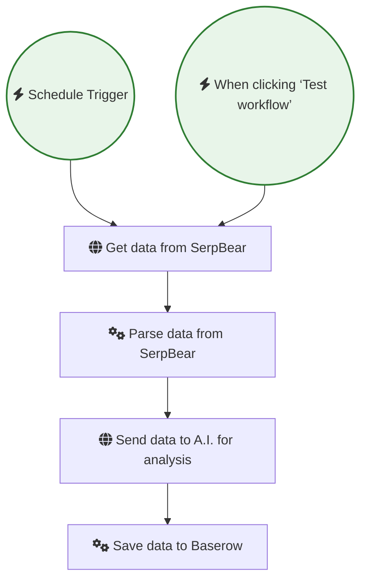

```mermaid
graph TD
    classDef trigger fill:#e8f5e9,stroke:#2e7d32,stroke-width:2px;
    classDef ai fill:#e3f2fd,stroke:#1565c0,stroke-width:2px;
    classDef logic fill:#fff3e0,stroke:#ef6c00,stroke-width:2px;

    When_clicking__Test_workflow_(("fas:fa-bolt When clicking ‘Test workflow’")):::trigger
    Schedule_Trigger(("fas:fa-bolt Schedule Trigger")):::trigger
    Get_data_from_SerpBear["fas:fa-globe Get data from SerpBear"]
    Parse_data_from_SerpBear["fas:fa-cogs Parse data from SerpBear"]
    Send_data_to_A_I__for_analysis["fas:fa-globe Send data to A.I. for analysis"]
    Save_data_to_Baserow["fas:fa-cogs Save data to Baserow"]

    Schedule_Trigger --> Get_data_from_SerpBear
    Get_data_from_SerpBear --> Parse_data_from_SerpBear
    Parse_data_from_SerpBear --> Send_data_to_A_I__for_analysis
    Send_data_to_A_I__for_analysis --> Save_data_to_Baserow
    When_clicking__Test_workflow_ --> Get_data_from_SerpBear
```
