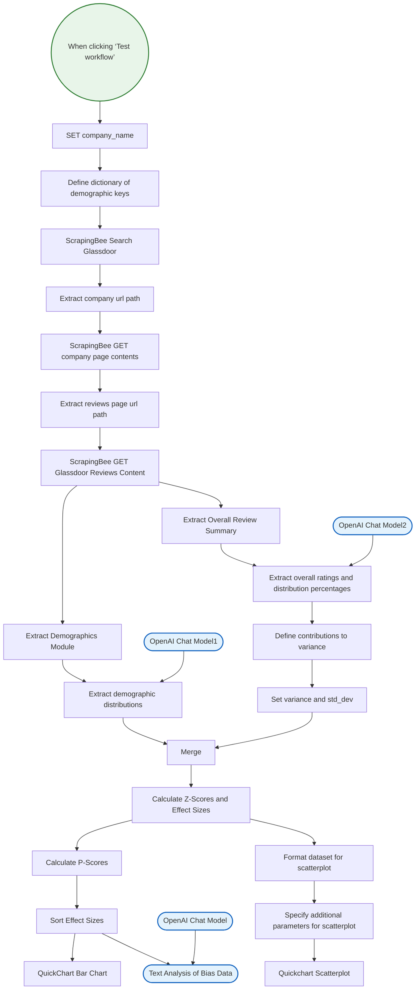

```mermaid
graph TD
    classDef trigger fill:#e8f5e9,stroke:#2e7d32,stroke-width:2px;
    classDef ai fill:#e3f2fd,stroke:#1565c0,stroke-width:2px;
    classDef logic fill:#fff3e0,stroke:#ef6c00,stroke-width:2px;

    When_clicking__Test_workflow_(("When clicking ‘Test workflow’")):::trigger
    OpenAI_Chat_Model1(["OpenAI Chat Model1"]):::ai
    OpenAI_Chat_Model2(["OpenAI Chat Model2"]):::ai
    Merge["Merge"]
    OpenAI_Chat_Model(["OpenAI Chat Model"]):::ai
    SET_company_name["SET company_name"]
    Define_dictionary_of_demographic_keys["Define dictionary of demographic keys"]
    ScrapingBee_Search_Glassdoor["ScrapingBee Search Glassdoor"]
    Extract_company_url_path["Extract company url path"]
    ScrapingBee_GET_company_page_contents["ScrapingBee GET company page contents"]
    Extract_reviews_page_url_path["Extract reviews page url path"]
    ScrapingBee_GET_Glassdoor_Reviews_Content["ScrapingBee GET Glassdoor Reviews Content"]
    Extract_Overall_Review_Summary["Extract Overall Review Summary"]
    Extract_Demographics_Module["Extract Demographics Module"]
    Extract_overall_ratings_and_distribution_percentages["Extract overall ratings and distribution percentages"]
    Extract_demographic_distributions["Extract demographic distributions"]
    Define_contributions_to_variance["Define contributions to variance"]
    Set_variance_and_std_dev["Set variance and std_dev"]
    Calculate_P_Scores["Calculate P-Scores"]
    Sort_Effect_Sizes["Sort Effect Sizes"]
    Calculate_Z_Scores_and_Effect_Sizes["Calculate Z-Scores and Effect Sizes"]
    Format_dataset_for_scatterplot["Format dataset for scatterplot"]
    Specify_additional_parameters_for_scatterplot["Specify additional parameters for scatterplot"]
    Quickchart_Scatterplot["Quickchart Scatterplot"]
    QuickChart_Bar_Chart["QuickChart Bar Chart"]
    Text_Analysis_of_Bias_Data(["Text Analysis of Bias Data"]):::ai

    Merge --> Calculate_Z_Scores_and_Effect_Sizes
    SET_company_name --> Define_dictionary_of_demographic_keys
    OpenAI_Chat_Model --> Text_Analysis_of_Bias_Data
    Sort_Effect_Sizes --> QuickChart_Bar_Chart
    Sort_Effect_Sizes --> Text_Analysis_of_Bias_Data
    Calculate_P_Scores --> Sort_Effect_Sizes
    OpenAI_Chat_Model1 --> Extract_demographic_distributions
    OpenAI_Chat_Model2 --> Extract_overall_ratings_and_distribution_percentages
    Extract_company_url_path --> ScrapingBee_GET_company_page_contents
    Set_variance_and_std_dev --> Merge
    Extract_Demographics_Module --> Extract_demographic_distributions
    ScrapingBee_Search_Glassdoor --> Extract_company_url_path
    Extract_reviews_page_url_path --> ScrapingBee_GET_Glassdoor_Reviews_Content
    Extract_Overall_Review_Summary --> Extract_overall_ratings_and_distribution_percentages
    Format_dataset_for_scatterplot --> Specify_additional_parameters_for_scatterplot
    Define_contributions_to_variance --> Set_variance_and_std_dev
    Extract_demographic_distributions --> Merge
    When_clicking__Test_workflow_ --> SET_company_name
    Calculate_Z_Scores_and_Effect_Sizes --> Calculate_P_Scores
    Calculate_Z_Scores_and_Effect_Sizes --> Format_dataset_for_scatterplot
    Define_dictionary_of_demographic_keys --> ScrapingBee_Search_Glassdoor
    ScrapingBee_GET_company_page_contents --> Extract_reviews_page_url_path
    ScrapingBee_GET_Glassdoor_Reviews_Content --> Extract_Demographics_Module
    ScrapingBee_GET_Glassdoor_Reviews_Content --> Extract_Overall_Review_Summary
    Specify_additional_parameters_for_scatterplot --> Quickchart_Scatterplot
    Extract_overall_ratings_and_distribution_percentages --> Define_contributions_to_variance
```
