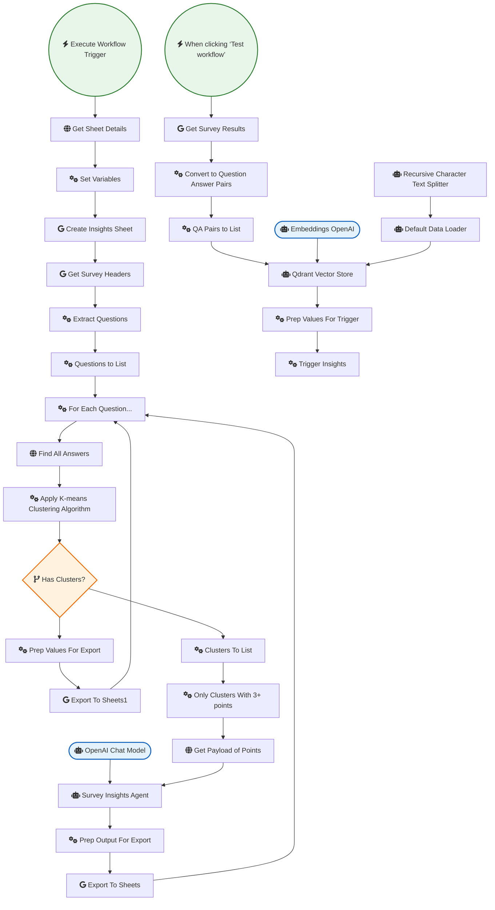

```mermaid
graph TD
    classDef trigger fill:#e8f5e9,stroke:#2e7d32,stroke-width:2px;
    classDef ai fill:#e3f2fd,stroke:#1565c0,stroke-width:2px;
    classDef logic fill:#fff3e0,stroke:#ef6c00,stroke-width:2px;

    Embeddings_OpenAI(["fas:fa-robot Embeddings OpenAI"]):::ai
    Default_Data_Loader["fas:fa-robot Default Data Loader"]
    Convert_to_Question_Answer_Pairs["fas:fa-cogs Convert to Question Answer Pairs"]
    Recursive_Character_Text_Splitter["fas:fa-robot Recursive Character Text Splitter"]
    Get_Survey_Results["fab:fa-google Get Survey Results"]
    Get_Survey_Headers["fab:fa-google Get Survey Headers"]
    Extract_Questions["fas:fa-cogs Extract Questions"]
    Questions_to_List["fas:fa-cogs Questions to List"]
    Find_All_Answers["fas:fa-globe Find All Answers"]
    Get_Payload_of_Points["fas:fa-globe Get Payload of Points"]
    Clusters_To_List["fas:fa-cogs Clusters To List"]
    Set_Variables["fas:fa-cogs Set Variables"]
    OpenAI_Chat_Model(["fas:fa-robot OpenAI Chat Model"]):::ai
    Prep_Output_For_Export["fas:fa-cogs Prep Output For Export"]
    Export_To_Sheets["fab:fa-google Export To Sheets"]
    Export_To_Sheets1["fab:fa-google Export To Sheets1"]
    For_Each_Question___["fas:fa-cogs For Each Question..."]
    Trigger_Insights["fas:fa-cogs Trigger Insights"]
    Prep_Values_For_Trigger["fas:fa-cogs Prep Values For Trigger"]
    Execute_Workflow_Trigger(("fas:fa-bolt Execute Workflow Trigger")):::trigger
    Create_Insights_Sheet["fab:fa-google Create Insights Sheet"]
    Prep_Values_For_Export["fas:fa-cogs Prep Values For Export"]
    QA_Pairs_to_List["fas:fa-cogs QA Pairs to List"]
    Has_Clusters_{"fas:fa-code-branch Has Clusters?"}:::logic
    When_clicking__Test_workflow_(("fas:fa-bolt When clicking ‘Test workflow’")):::trigger
    Get_Sheet_Details["fas:fa-globe Get Sheet Details"]
    Only_Clusters_With_3__points["fas:fa-cogs Only Clusters With 3+ points"]
    Apply_K_means_Clustering_Algorithm["fas:fa-cogs Apply K-means Clustering Algorithm"]
    Qdrant_Vector_Store["fas:fa-robot Qdrant Vector Store"]
    Survey_Insights_Agent["fas:fa-robot Survey Insights Agent"]

    Has_Clusters_ --> Clusters_To_List
    Has_Clusters_ --> Prep_Values_For_Export
    Set_Variables --> Create_Insights_Sheet
    Clusters_To_List --> Only_Clusters_With_3__points
    Export_To_Sheets --> For_Each_Question___
    Find_All_Answers --> Apply_K_means_Clustering_Algorithm
    QA_Pairs_to_List --> Qdrant_Vector_Store
    Embeddings_OpenAI --> Qdrant_Vector_Store
    Export_To_Sheets1 --> For_Each_Question___
    Extract_Questions --> Questions_to_List
    Get_Sheet_Details --> Set_Variables
    OpenAI_Chat_Model --> Survey_Insights_Agent
    Questions_to_List --> For_Each_Question___
    Get_Survey_Headers --> Extract_Questions
    Get_Survey_Results --> Convert_to_Question_Answer_Pairs
    Default_Data_Loader --> Qdrant_Vector_Store
    Qdrant_Vector_Store --> Prep_Values_For_Trigger
    For_Each_Question___ --> Find_All_Answers
    Create_Insights_Sheet --> Get_Survey_Headers
    Get_Payload_of_Points --> Survey_Insights_Agent
    Survey_Insights_Agent --> Prep_Output_For_Export
    Prep_Output_For_Export --> Export_To_Sheets
    Prep_Values_For_Export --> Export_To_Sheets1
    Prep_Values_For_Trigger --> Trigger_Insights
    Execute_Workflow_Trigger --> Get_Sheet_Details
    Only_Clusters_With_3__points --> Get_Payload_of_Points
    Convert_to_Question_Answer_Pairs --> QA_Pairs_to_List
    Recursive_Character_Text_Splitter --> Default_Data_Loader
    When_clicking__Test_workflow_ --> Get_Survey_Results
    Apply_K_means_Clustering_Algorithm --> Has_Clusters_
```
