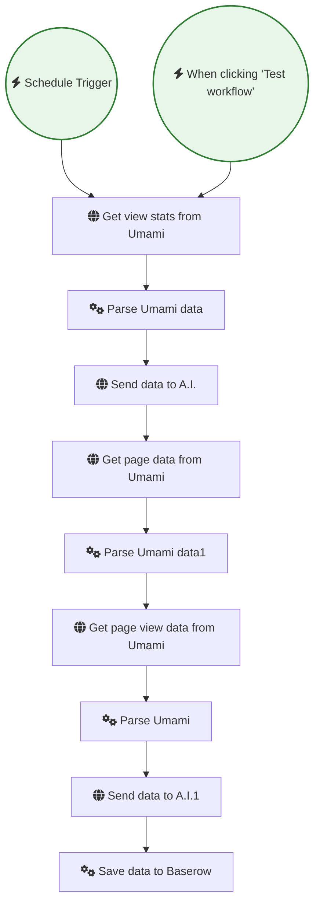

```mermaid
graph TD
    classDef trigger fill:#e8f5e9,stroke:#2e7d32,stroke-width:2px;
    classDef ai fill:#e3f2fd,stroke:#1565c0,stroke-width:2px;
    classDef logic fill:#fff3e0,stroke:#ef6c00,stroke-width:2px;

    When_clicking__Test_workflow_(("fas:fa-bolt When clicking ‘Test workflow’")):::trigger
    Schedule_Trigger(("fas:fa-bolt Schedule Trigger")):::trigger
    Get_view_stats_from_Umami["fas:fa-globe Get view stats from Umami"]
    Parse_Umami_data["fas:fa-cogs Parse Umami data"]
    Send_data_to_A_I_["fas:fa-globe Send data to A.I."]
    Get_page_data_from_Umami["fas:fa-globe Get page data from Umami"]
    Parse_Umami_data1["fas:fa-cogs Parse Umami data1"]
    Get_page_view_data_from_Umami["fas:fa-globe Get page view data from Umami"]
    Parse_Umami["fas:fa-cogs Parse Umami"]
    Send_data_to_A_I_1["fas:fa-globe Send data to A.I.1"]
    Save_data_to_Baserow["fas:fa-cogs Save data to Baserow"]

    Parse_Umami --> Send_data_to_A_I_1
    Parse_Umami_data --> Send_data_to_A_I_
    Schedule_Trigger --> Get_view_stats_from_Umami
    Parse_Umami_data1 --> Get_page_view_data_from_Umami
    Send_data_to_A_I_ --> Get_page_data_from_Umami
    Send_data_to_A_I_1 --> Save_data_to_Baserow
    Get_page_data_from_Umami --> Parse_Umami_data1
    Get_view_stats_from_Umami --> Parse_Umami_data
    Get_page_view_data_from_Umami --> Parse_Umami
    When_clicking__Test_workflow_ --> Get_view_stats_from_Umami
```
