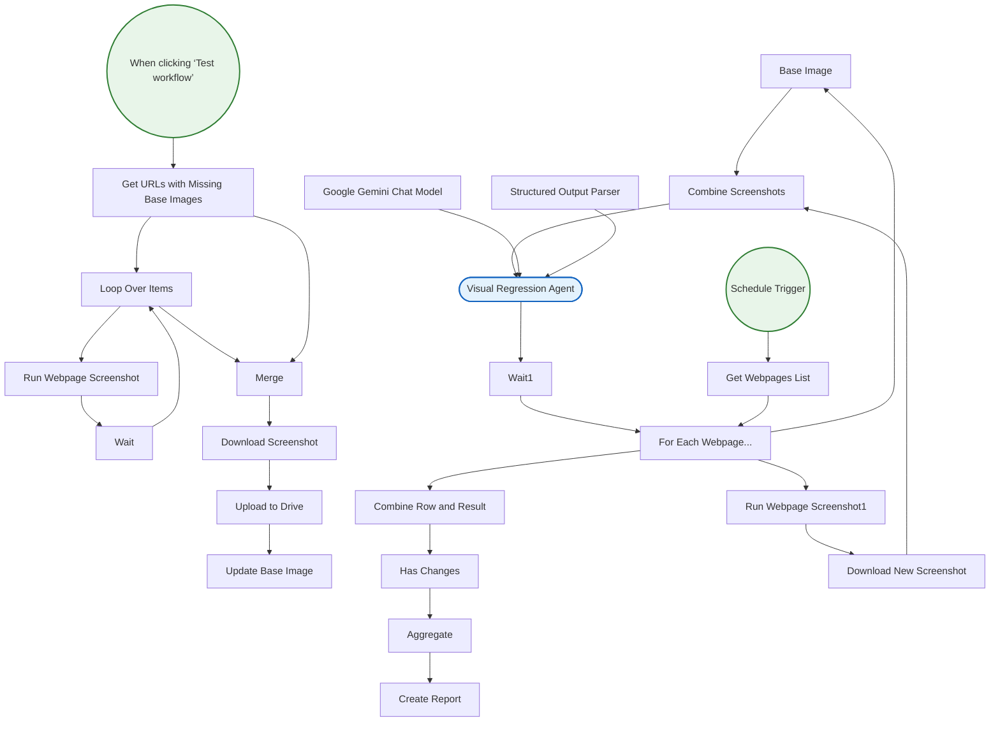

```mermaid
graph TD
    classDef trigger fill:#e8f5e9,stroke:#2e7d32,stroke-width:2px;
    classDef ai fill:#e3f2fd,stroke:#1565c0,stroke-width:2px;
    classDef logic fill:#fff3e0,stroke:#ef6c00,stroke-width:2px;

    Base_Image["Base Image"]
    Google_Gemini_Chat_Model["Google Gemini Chat Model"]
    Structured_Output_Parser["Structured Output Parser"]
    Loop_Over_Items["Loop Over Items"]
    Wait["Wait"]
    Download_Screenshot["Download Screenshot"]
    Upload_to_Drive["Upload to Drive"]
    Update_Base_Image["Update Base Image"]
    Merge["Merge"]
    Schedule_Trigger(("Schedule Trigger")):::trigger
    Get_URLs_with_Missing_Base_Images["Get URLs with Missing Base Images"]
    Run_Webpage_Screenshot["Run Webpage Screenshot"]
    Run_Webpage_Screenshot1["Run Webpage Screenshot1"]
    Has_Changes["Has Changes"]
    Combine_Row_and_Result["Combine Row and Result"]
    Wait1["Wait1"]
    Aggregate["Aggregate"]
    Create_Report["Create Report"]
    When_clicking__Test_workflow_(("When clicking ‘Test workflow’")):::trigger
    Get_Webpages_List["Get Webpages List"]
    For_Each_Webpage___["For Each Webpage..."]
    Download_New_Screenshot["Download New Screenshot"]
    Combine_Screenshots["Combine Screenshots"]
    Visual_Regression_Agent(["Visual Regression Agent"]):::ai

    Wait --> Loop_Over_Items
    Merge --> Download_Screenshot
    Wait1 --> For_Each_Webpage___
    Aggregate --> Create_Report
    Base_Image --> Combine_Screenshots
    Has_Changes --> Aggregate
    Loop_Over_Items --> Merge
    Loop_Over_Items --> Run_Webpage_Screenshot
    Upload_to_Drive --> Update_Base_Image
    Schedule_Trigger --> Get_Webpages_List
    Get_Webpages_List --> For_Each_Webpage___
    Combine_Screenshots --> Visual_Regression_Agent
    Download_Screenshot --> Upload_to_Drive
    For_Each_Webpage___ --> Combine_Row_and_Result
    For_Each_Webpage___ --> Base_Image
    For_Each_Webpage___ --> Run_Webpage_Screenshot1
    Combine_Row_and_Result --> Has_Changes
    Run_Webpage_Screenshot --> Wait
    Download_New_Screenshot --> Combine_Screenshots
    Run_Webpage_Screenshot1 --> Download_New_Screenshot
    Visual_Regression_Agent --> Wait1
    Google_Gemini_Chat_Model --> Visual_Regression_Agent
    Structured_Output_Parser --> Visual_Regression_Agent
    Get_URLs_with_Missing_Base_Images --> Loop_Over_Items
    Get_URLs_with_Missing_Base_Images --> Merge
    When_clicking__Test_workflow_ --> Get_URLs_with_Missing_Base_Images
```
