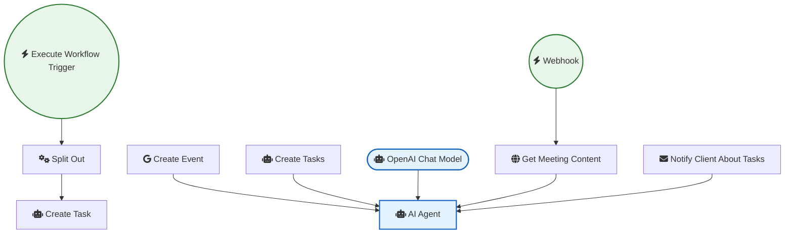

```mermaid
graph TD
    classDef trigger fill:#e8f5e9,stroke:#2e7d32,stroke-width:2px;
    classDef ai fill:#e3f2fd,stroke:#1565c0,stroke-width:2px;
    classDef logic fill:#fff3e0,stroke:#ef6c00,stroke-width:2px;

    AI_Agent["fas:fa-robot AI Agent"]:::ai
    OpenAI_Chat_Model(["fas:fa-robot OpenAI Chat Model"]):::ai
    Create_Tasks["fas:fa-robot Create Tasks"]
    Notify_Client_About_Tasks["fas:fa-envelope Notify Client About Tasks"]
    Execute_Workflow_Trigger(("fas:fa-bolt Execute Workflow Trigger")):::trigger
    Split_Out["fas:fa-cogs Split Out"]
    Create_Task["fas:fa-robot Create Task"]
    Create_Event["fab:fa-google Create Event"]
    Webhook(("fas:fa-bolt Webhook")):::trigger
    Get_Meeting_Content["fas:fa-globe Get Meeting Content"]

    Webhook --> Get_Meeting_Content
    Split_Out --> Create_Task
    Create_Event --> AI_Agent
    Create_Tasks --> AI_Agent
    OpenAI_Chat_Model --> AI_Agent
    Get_Meeting_Content --> AI_Agent
    Execute_Workflow_Trigger --> Split_Out
    Notify_Client_About_Tasks --> AI_Agent
```
