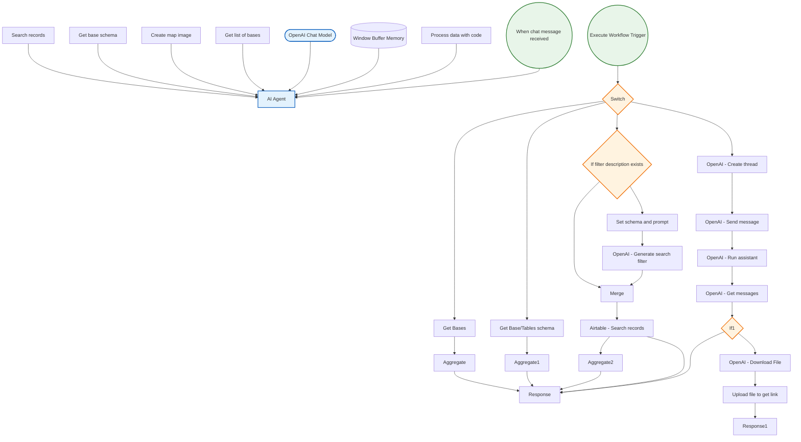

```mermaid
graph TD
    classDef trigger fill:#e8f5e9,stroke:#2e7d32,stroke-width:2px;
    classDef ai fill:#e3f2fd,stroke:#1565c0,stroke-width:2px;
    classDef logic fill:#fff3e0,stroke:#ef6c00,stroke-width:2px;

    OpenAI_Chat_Model(["OpenAI Chat Model"]):::ai
    AI_Agent["AI Agent"]:::ai
    Window_Buffer_Memory[("Window Buffer Memory")]
    When_chat_message_received(("When chat message received")):::trigger
    Execute_Workflow_Trigger(("Execute Workflow Trigger")):::trigger
    Response["Response"]
    Switch{"Switch"}:::logic
    Aggregate["Aggregate"]
    Aggregate1["Aggregate1"]
    Merge["Merge"]
    Aggregate2["Aggregate2"]
    If1{"If1"}:::logic
    Response1["Response1"]
    Search_records["Search records"]
    Process_data_with_code["Process data with code"]
    Create_map_image["Create map image"]
    Get_list_of_bases["Get list of bases"]
    Get_base_schema["Get base schema"]
    Get_Bases["Get Bases"]
    Get_Base_Tables_schema["Get Base/Tables schema"]
    If_filter_description_exists{"If filter description exists"}:::logic
    Airtable___Search_records["Airtable - Search records"]
    OpenAI___Generate_search_filter["OpenAI - Generate search filter"]
    Set_schema_and_prompt["Set schema and prompt"]
    Upload_file_to_get_link["Upload file to get link"]
    OpenAI___Download_File["OpenAI - Download File"]
    OpenAI___Get_messages["OpenAI - Get messages"]
    OpenAI___Run_assistant["OpenAI - Run assistant"]
    OpenAI___Send_message["OpenAI - Send message"]
    OpenAI___Create_thread["OpenAI - Create thread"]

    If1 --> Response
    If1 --> OpenAI___Download_File
    Merge --> Airtable___Search_records
    Switch --> Get_Bases
    Switch --> Get_Base_Tables_schema
    Switch --> If_filter_description_exists
    Switch --> OpenAI___Create_thread
    Aggregate --> Response
    Get_Bases --> Aggregate
    Aggregate1 --> Response
    Aggregate2 --> Response
    Search_records --> AI_Agent
    Get_base_schema --> AI_Agent
    Create_map_image --> AI_Agent
    Get_list_of_bases --> AI_Agent
    OpenAI_Chat_Model --> AI_Agent
    Window_Buffer_Memory --> AI_Agent
    OpenAI___Get_messages --> If1
    OpenAI___Send_message --> OpenAI___Run_assistant
    Set_schema_and_prompt --> OpenAI___Generate_search_filter
    Get_Base_Tables_schema --> Aggregate1
    OpenAI___Create_thread --> OpenAI___Send_message
    OpenAI___Download_File --> Upload_file_to_get_link
    OpenAI___Run_assistant --> OpenAI___Get_messages
    Process_data_with_code --> AI_Agent
    Upload_file_to_get_link --> Response1
    Execute_Workflow_Trigger --> Switch
    Airtable___Search_records --> Aggregate2
    Airtable___Search_records --> Response
    When_chat_message_received --> AI_Agent
    If_filter_description_exists --> Merge
    If_filter_description_exists --> Set_schema_and_prompt
    OpenAI___Generate_search_filter --> Merge
```
