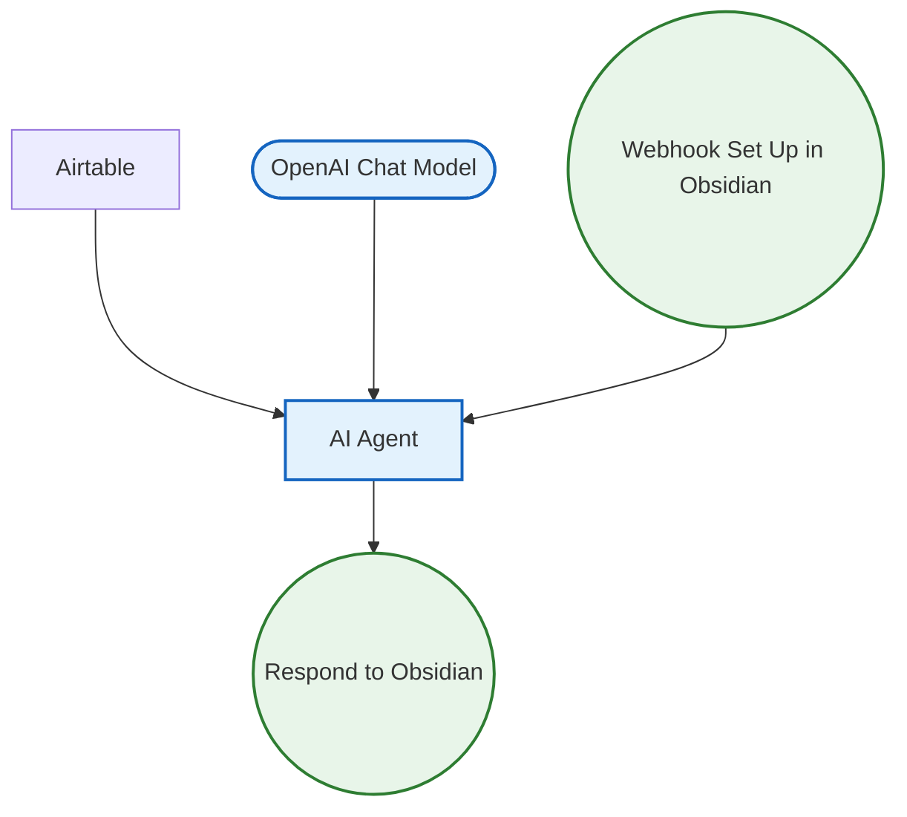

```mermaid
graph TD
    classDef trigger fill:#e8f5e9,stroke:#2e7d32,stroke-width:2px;
    classDef ai fill:#e3f2fd,stroke:#1565c0,stroke-width:2px;
    classDef logic fill:#fff3e0,stroke:#ef6c00,stroke-width:2px;

    Airtable["Airtable"]
    OpenAI_Chat_Model(["OpenAI Chat Model"]):::ai
    AI_Agent["AI Agent"]:::ai
    Respond_to_Obsidian(("Respond to Obsidian")):::trigger
    Webhook_Set_Up_in_Obsidian(("Webhook Set Up in Obsidian")):::trigger

    AI_Agent --> Respond_to_Obsidian
    Airtable --> AI_Agent
    OpenAI_Chat_Model --> AI_Agent
    Webhook_Set_Up_in_Obsidian --> AI_Agent
```
