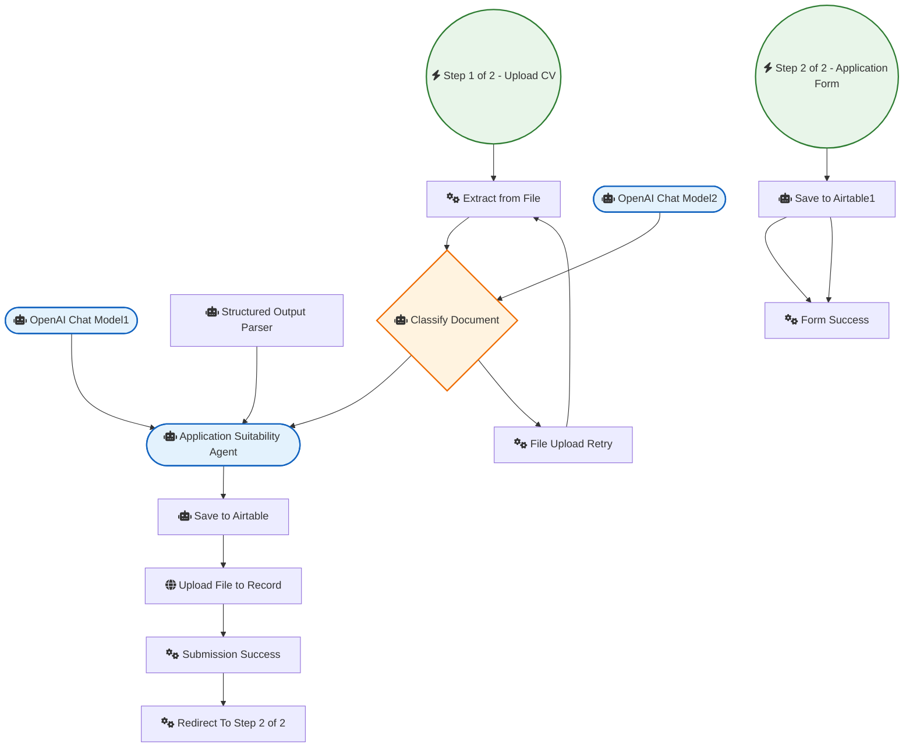

```mermaid
graph TD
    classDef trigger fill:#e8f5e9,stroke:#2e7d32,stroke-width:2px;
    classDef ai fill:#e3f2fd,stroke:#1565c0,stroke-width:2px;
    classDef logic fill:#fff3e0,stroke:#ef6c00,stroke-width:2px;

    Extract_from_File["fas:fa-cogs Extract from File"]
    OpenAI_Chat_Model1(["fas:fa-robot OpenAI Chat Model1"]):::ai
    Structured_Output_Parser["fas:fa-robot Structured Output Parser"]
    OpenAI_Chat_Model2(["fas:fa-robot OpenAI Chat Model2"]):::ai
    Step_1_of_2___Upload_CV(("fas:fa-bolt Step 1 of 2 - Upload CV")):::trigger
    Save_to_Airtable["fas:fa-robot Save to Airtable"]
    Classify_Document{"fas:fa-robot Classify Document"}:::logic
    Upload_File_to_Record["fas:fa-globe Upload File to Record"]
    Form_Success["fas:fa-cogs Form Success"]
    Save_to_Airtable1["fas:fa-robot Save to Airtable1"]
    Step_2_of_2___Application_Form(("fas:fa-bolt Step 2 of 2 - Application Form")):::trigger
    Application_Suitability_Agent(["fas:fa-robot Application Suitability Agent"]):::ai
    File_Upload_Retry["fas:fa-cogs File Upload Retry"]
    Redirect_To_Step_2_of_2["fas:fa-cogs Redirect To Step 2 of 2"]
    Submission_Success["fas:fa-cogs Submission Success"]

    Save_to_Airtable --> Upload_File_to_Record
    Classify_Document --> Application_Suitability_Agent
    Classify_Document --> File_Upload_Retry
    Extract_from_File --> Classify_Document
    File_Upload_Retry --> Extract_from_File
    Save_to_Airtable1 --> Form_Success
    Save_to_Airtable1 --> Form_Success
    OpenAI_Chat_Model1 --> Application_Suitability_Agent
    OpenAI_Chat_Model2 --> Classify_Document
    Submission_Success --> Redirect_To_Step_2_of_2
    Upload_File_to_Record --> Submission_Success
    Step_1_of_2___Upload_CV --> Extract_from_File
    Structured_Output_Parser --> Application_Suitability_Agent
    Application_Suitability_Agent --> Save_to_Airtable
    Step_2_of_2___Application_Form --> Save_to_Airtable1
```
