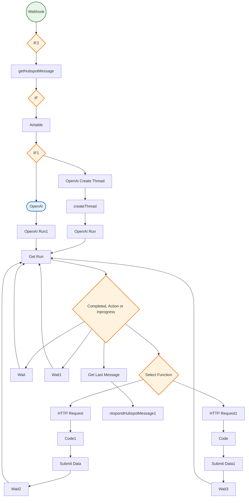

```mermaid
graph TD
    classDef trigger fill:#e8f5e9,stroke:#2e7d32,stroke-width:2px;
    classDef ai fill:#e3f2fd,stroke:#1565c0,stroke-width:2px;
    classDef logic fill:#fff3e0,stroke:#ef6c00,stroke-width:2px;

    getHubspotMessage["getHubspotMessage"]
    OpenAi_Create_Thread["OpenAi Create Thread"]
    OpenAI_Run["OpenAI Run"]
    Get_Run["Get Run"]
    Get_Last_Message["Get Last Message"]
    HTTP_Request["HTTP Request"]
    Completed__Action_or_Inprogress{"Completed, Action or Inprogress"}:::logic
    Wait["Wait"]
    Wait1["Wait1"]
    Submit_Data["Submit Data"]
    Select_Function{"Select Function"}:::logic
    Code1["Code1"]
    Wait2["Wait2"]
    HTTP_Request1["HTTP Request1"]
    Code["Code"]
    Submit_Data1["Submit Data1"]
    Wait3["Wait3"]
    respondHubspotMessage1["respondHubspotMessage1"]
    IF{"IF"}:::logic
    Airtable["Airtable"]
    IF1{"IF1"}:::logic
    createThread["createThread"]
    OpenAI_Run1["OpenAI Run1"]
    IF2{"IF2"}:::logic
    OpenAI(["OpenAI"]):::ai
    Webhook(("Webhook")):::trigger

    IF --> Airtable
    IF1 --> OpenAi_Create_Thread
    IF1 --> OpenAI
    IF2 --> getHubspotMessage
    Code --> Submit_Data1
    Wait --> Get_Run
    Code1 --> Submit_Data
    Wait1 --> Get_Run
    Wait2 --> Get_Run
    Wait3 --> Get_Run
    OpenAI --> OpenAI_Run1
    Get_Run --> Completed__Action_or_Inprogress
    Webhook --> IF2
    Airtable --> IF1
    OpenAI_Run --> Get_Run
    OpenAI_Run1 --> Get_Run
    Submit_Data --> Wait2
    HTTP_Request --> Code1
    Submit_Data1 --> Wait3
    createThread --> OpenAI_Run
    HTTP_Request1 --> Code
    Select_Function --> HTTP_Request
    Select_Function --> HTTP_Request1
    Get_Last_Message --> respondHubspotMessage1
    getHubspotMessage --> IF
    OpenAi_Create_Thread --> createThread
    Completed__Action_or_Inprogress --> Get_Last_Message
    Completed__Action_or_Inprogress --> Select_Function
    Completed__Action_or_Inprogress --> Wait1
    Completed__Action_or_Inprogress --> Wait
```
