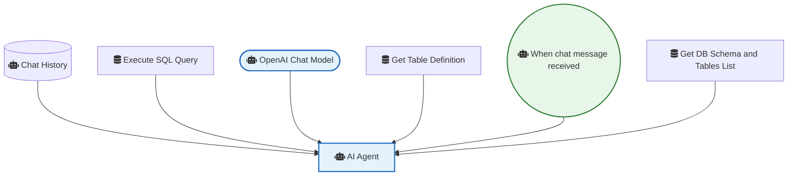

```mermaid
graph TD
    classDef trigger fill:#e8f5e9,stroke:#2e7d32,stroke-width:2px;
    classDef ai fill:#e3f2fd,stroke:#1565c0,stroke-width:2px;
    classDef logic fill:#fff3e0,stroke:#ef6c00,stroke-width:2px;

    When_chat_message_received(("fas:fa-robot When chat message received")):::trigger
    AI_Agent["fas:fa-robot AI Agent"]:::ai
    OpenAI_Chat_Model(["fas:fa-robot OpenAI Chat Model"]):::ai
    Get_Table_Definition["fas:fa-database Get Table Definition"]
    Chat_History[("fas:fa-robot Chat History")]
    Execute_SQL_Query["fas:fa-database Execute SQL Query"]
    Get_DB_Schema_and_Tables_List["fas:fa-database Get DB Schema and Tables List"]

    Chat_History --> AI_Agent
    Execute_SQL_Query --> AI_Agent
    OpenAI_Chat_Model --> AI_Agent
    Get_Table_Definition --> AI_Agent
    When_chat_message_received --> AI_Agent
    Get_DB_Schema_and_Tables_List --> AI_Agent
```
