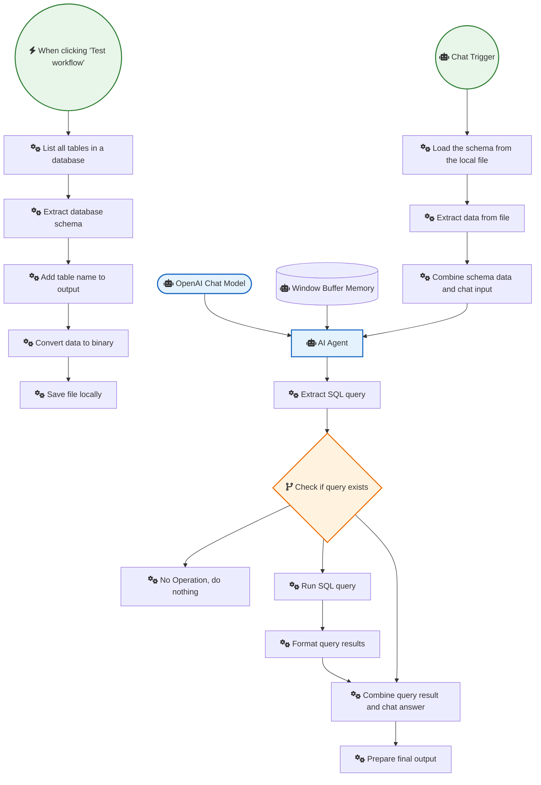

```mermaid
graph TD
    classDef trigger fill:#e8f5e9,stroke:#2e7d32,stroke-width:2px;
    classDef ai fill:#e3f2fd,stroke:#1565c0,stroke-width:2px;
    classDef logic fill:#fff3e0,stroke:#ef6c00,stroke-width:2px;

    OpenAI_Chat_Model(["fas:fa-robot OpenAI Chat Model"]):::ai
    Window_Buffer_Memory[("fas:fa-robot Window Buffer Memory")]
    No_Operation__do_nothing["fas:fa-cogs No Operation, do nothing"]
    List_all_tables_in_a_database["fas:fa-cogs List all tables in a database"]
    Extract_database_schema["fas:fa-cogs Extract database schema"]
    Add_table_name_to_output["fas:fa-cogs Add table name to output"]
    Convert_data_to_binary["fas:fa-cogs Convert data to binary"]
    Save_file_locally["fas:fa-cogs Save file locally"]
    Extract_data_from_file["fas:fa-cogs Extract data from file"]
    Chat_Trigger(("fas:fa-robot Chat Trigger")):::trigger
    AI_Agent["fas:fa-robot AI Agent"]:::ai
    When_clicking__Test_workflow_(("fas:fa-bolt When clicking 'Test workflow'")):::trigger
    Combine_schema_data_and_chat_input["fas:fa-cogs Combine schema data and chat input"]
    Load_the_schema_from_the_local_file["fas:fa-cogs Load the schema from the local file"]
    Extract_SQL_query["fas:fa-cogs Extract SQL query"]
    Check_if_query_exists{"fas:fa-code-branch Check if query exists"}:::logic
    Format_query_results["fas:fa-cogs Format query results"]
    Run_SQL_query["fas:fa-cogs Run SQL query"]
    Prepare_final_output["fas:fa-cogs Prepare final output"]
    Combine_query_result_and_chat_answer["fas:fa-cogs Combine query result and chat answer"]

    AI_Agent --> Extract_SQL_query
    Chat_Trigger --> Load_the_schema_from_the_local_file
    Run_SQL_query --> Format_query_results
    Extract_SQL_query --> Check_if_query_exists
    OpenAI_Chat_Model --> AI_Agent
    Format_query_results --> Combine_query_result_and_chat_answer
    Window_Buffer_Memory --> AI_Agent
    Check_if_query_exists --> Run_SQL_query
    Check_if_query_exists --> Combine_query_result_and_chat_answer
    Check_if_query_exists --> No_Operation__do_nothing
    Convert_data_to_binary --> Save_file_locally
    Extract_data_from_file --> Combine_schema_data_and_chat_input
    Extract_database_schema --> Add_table_name_to_output
    Add_table_name_to_output --> Convert_data_to_binary
    List_all_tables_in_a_database --> Extract_database_schema
    When_clicking__Test_workflow_ --> List_all_tables_in_a_database
    Combine_schema_data_and_chat_input --> AI_Agent
    Load_the_schema_from_the_local_file --> Extract_data_from_file
    Combine_query_result_and_chat_answer --> Prepare_final_output
```
