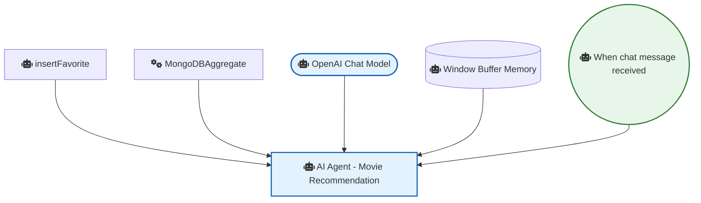

```mermaid
graph TD
    classDef trigger fill:#e8f5e9,stroke:#2e7d32,stroke-width:2px;
    classDef ai fill:#e3f2fd,stroke:#1565c0,stroke-width:2px;
    classDef logic fill:#fff3e0,stroke:#ef6c00,stroke-width:2px;

    OpenAI_Chat_Model(["fas:fa-robot OpenAI Chat Model"]):::ai
    MongoDBAggregate["fas:fa-cogs MongoDBAggregate"]
    Window_Buffer_Memory[("fas:fa-robot Window Buffer Memory")]
    When_chat_message_received(("fas:fa-robot When chat message received")):::trigger
    insertFavorite["fas:fa-robot insertFavorite"]
    AI_Agent___Movie_Recommendation["fas:fa-robot AI Agent - Movie Recommendation"]:::ai

    insertFavorite --> AI_Agent___Movie_Recommendation
    MongoDBAggregate --> AI_Agent___Movie_Recommendation
    OpenAI_Chat_Model --> AI_Agent___Movie_Recommendation
    Window_Buffer_Memory --> AI_Agent___Movie_Recommendation
    When_chat_message_received --> AI_Agent___Movie_Recommendation
```
