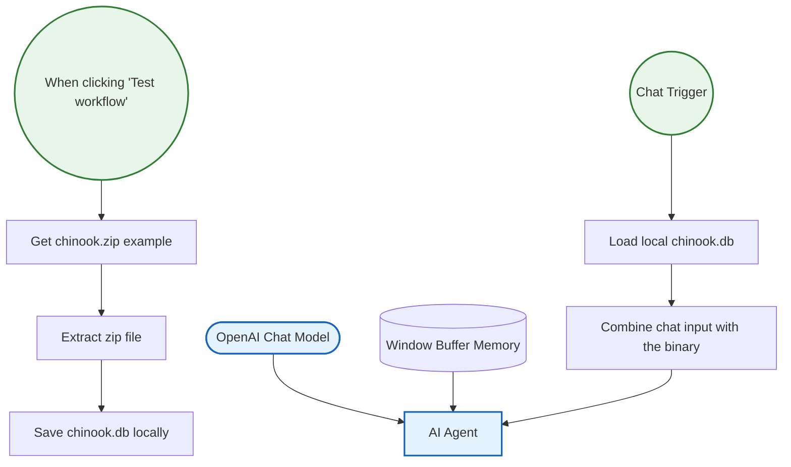

```mermaid
graph TD
    classDef trigger fill:#e8f5e9,stroke:#2e7d32,stroke-width:2px;
    classDef ai fill:#e3f2fd,stroke:#1565c0,stroke-width:2px;
    classDef logic fill:#fff3e0,stroke:#ef6c00,stroke-width:2px;

    Window_Buffer_Memory[("Window Buffer Memory")]
    OpenAI_Chat_Model(["OpenAI Chat Model"]):::ai
    When_clicking__Test_workflow_(("When clicking 'Test workflow'")):::trigger
    Get_chinook_zip_example["Get chinook.zip example"]
    Extract_zip_file["Extract zip file"]
    Save_chinook_db_locally["Save chinook.db locally"]
    Load_local_chinook_db["Load local chinook.db"]
    Combine_chat_input_with_the_binary["Combine chat input with the binary"]
    AI_Agent["AI Agent"]:::ai
    Chat_Trigger(("Chat Trigger")):::trigger

    Chat_Trigger --> Load_local_chinook_db
    Extract_zip_file --> Save_chinook_db_locally
    OpenAI_Chat_Model --> AI_Agent
    Window_Buffer_Memory --> AI_Agent
    Load_local_chinook_db --> Combine_chat_input_with_the_binary
    Get_chinook_zip_example --> Extract_zip_file
    When_clicking__Test_workflow_ --> Get_chinook_zip_example
    Combine_chat_input_with_the_binary --> AI_Agent
```
