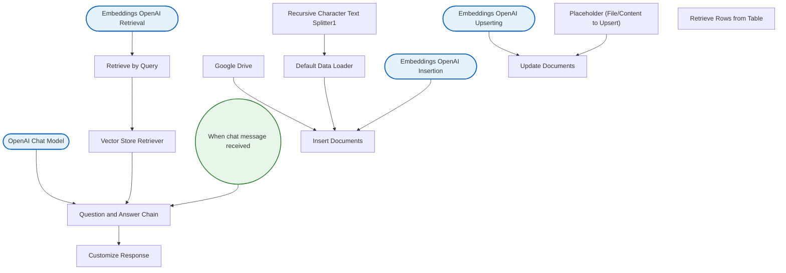

```mermaid
graph TD
    classDef trigger fill:#e8f5e9,stroke:#2e7d32,stroke-width:2px;
    classDef ai fill:#e3f2fd,stroke:#1565c0,stroke-width:2px;
    classDef logic fill:#fff3e0,stroke:#ef6c00,stroke-width:2px;

    Google_Drive["Google Drive"]
    Default_Data_Loader["Default Data Loader"]
    Question_and_Answer_Chain["Question and Answer Chain"]
    OpenAI_Chat_Model(["OpenAI Chat Model"]):::ai
    Vector_Store_Retriever["Vector Store Retriever"]
    Recursive_Character_Text_Splitter1["Recursive Character Text Splitter1"]
    Customize_Response["Customize Response"]
    When_chat_message_received(("When chat message received")):::trigger
    Retrieve_by_Query["Retrieve by Query"]
    Embeddings_OpenAI_Retrieval(["Embeddings OpenAI Retrieval"]):::ai
    Embeddings_OpenAI_Insertion(["Embeddings OpenAI Insertion"]):::ai
    Placeholder__File_Content_to_Upsert_["Placeholder (File/Content to Upsert)"]
    Embeddings_OpenAI_Upserting(["Embeddings OpenAI Upserting"]):::ai
    Insert_Documents["Insert Documents"]
    Retrieve_Rows_from_Table["Retrieve Rows from Table"]
    Update_Documents["Update Documents"]

    Google_Drive --> Insert_Documents
    OpenAI_Chat_Model --> Question_and_Answer_Chain
    Retrieve_by_Query --> Vector_Store_Retriever
    Default_Data_Loader --> Insert_Documents
    Vector_Store_Retriever --> Question_and_Answer_Chain
    Question_and_Answer_Chain --> Customize_Response
    When_chat_message_received --> Question_and_Answer_Chain
    Embeddings_OpenAI_Insertion --> Insert_Documents
    Embeddings_OpenAI_Retrieval --> Retrieve_by_Query
    Embeddings_OpenAI_Upserting --> Update_Documents
    Recursive_Character_Text_Splitter1 --> Default_Data_Loader
    Placeholder__File_Content_to_Upsert_ --> Update_Documents
```
