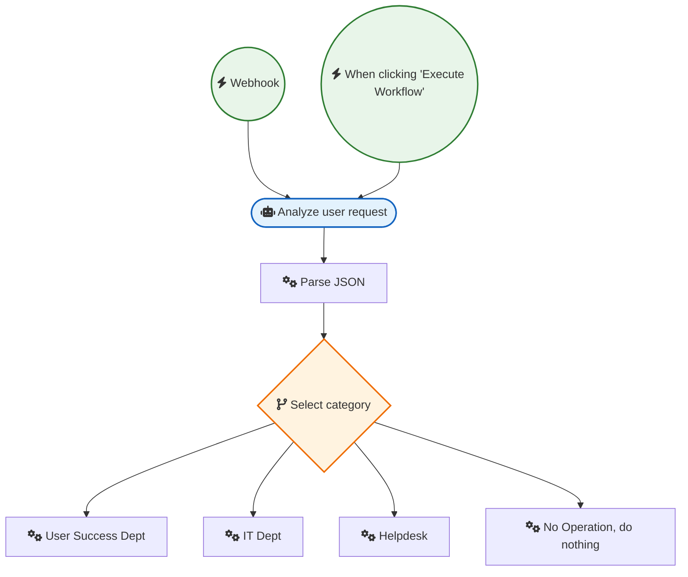

```mermaid
graph TD
    classDef trigger fill:#e8f5e9,stroke:#2e7d32,stroke-width:2px;
    classDef ai fill:#e3f2fd,stroke:#1565c0,stroke-width:2px;
    classDef logic fill:#fff3e0,stroke:#ef6c00,stroke-width:2px;

    When_clicking__Execute_Workflow_(("fas:fa-bolt When clicking 'Execute Workflow'")):::trigger
    Webhook(("fas:fa-bolt Webhook")):::trigger
    No_Operation__do_nothing["fas:fa-cogs No Operation, do nothing"]
    Analyze_user_request(["fas:fa-robot Analyze user request"]):::ai
    Select_category{"fas:fa-code-branch Select category"}:::logic
    Parse_JSON["fas:fa-cogs Parse JSON"]
    User_Success_Dept["fas:fa-cogs User Success Dept"]
    IT_Dept["fas:fa-cogs IT Dept"]
    Helpdesk["fas:fa-cogs Helpdesk"]

    Webhook --> Analyze_user_request
    Parse_JSON --> Select_category
    Select_category --> User_Success_Dept
    Select_category --> IT_Dept
    Select_category --> Helpdesk
    Select_category --> No_Operation__do_nothing
    Analyze_user_request --> Parse_JSON
    When_clicking__Execute_Workflow_ --> Analyze_user_request
```
