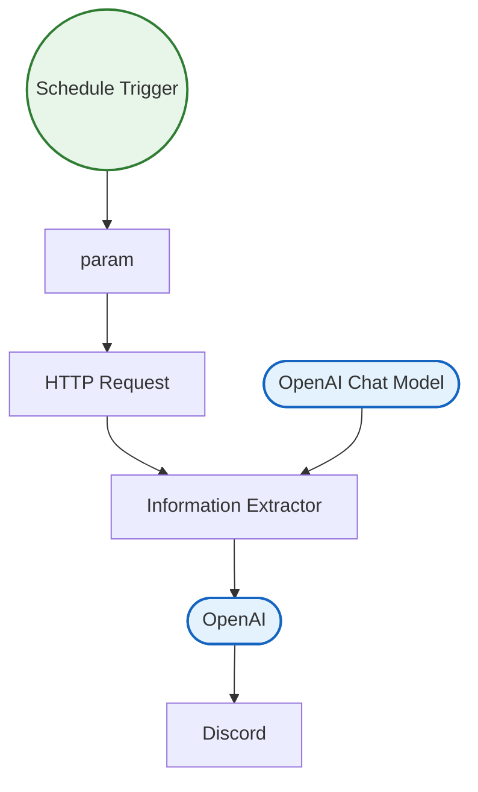

```mermaid
graph TD
    classDef trigger fill:#e8f5e9,stroke:#2e7d32,stroke-width:2px;
    classDef ai fill:#e3f2fd,stroke:#1565c0,stroke-width:2px;
    classDef logic fill:#fff3e0,stroke:#ef6c00,stroke-width:2px;

    Schedule_Trigger(("Schedule Trigger")):::trigger
    OpenAI(["OpenAI"]):::ai
    param["param"]
    Discord["Discord"]
    OpenAI_Chat_Model(["OpenAI Chat Model"]):::ai
    Information_Extractor["Information Extractor"]
    HTTP_Request["HTTP Request"]

    param --> HTTP_Request
    OpenAI --> Discord
    HTTP_Request --> Information_Extractor
    Schedule_Trigger --> param
    OpenAI_Chat_Model --> Information_Extractor
    Information_Extractor --> OpenAI
```
